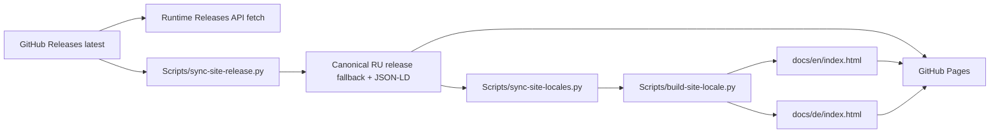

# Website Architecture

## Hosting boundary

`docs/` обслуживается GitHub Pages. Engineering knowledge base находится отдельно в `knowledge-base/`.

Маркетинговый сайт и локализации приложения — разные поверхности. **Сайт сейчас имеет три реальные статические языковые версии: RU (`/`), EN (`/en/`) и DE (`/de/`). Приложение Impuls 1.4.15 поддерживает семь языков интерфейса: `ru`, `en`, `de`, `fr`, `es`, `zh-Hans`, `ja`.** Фраза «7 языков интерфейса» описывает capability приложения и не означает, что сам сайт уже переведён на семь языков.

## Canonical source and generated pages

`docs/index.html` — canonical RU content/layout source и self-contained production page: no external CSS/JS/fonts и no runtime localization dependency. Значения design system остаются в CSS этой страницы; intent описан в [Website Design System](design-system.md).

Статические локализованные страницы генерируются одним `Scripts/build-site-locale.py`:

```text
docs/index.html (RU source)
        │
        ├── Scripts/site-locales/en.json ──> docs/en/index.html
        └── Scripts/site-locales/de.json ──> docs/de/index.html
```

`docs/en/index.html` и `docs/de/index.html` **не редактируются вручную**. Любой layout/content contract сначала меняется в canonical RU source или соответствующем locale config, затем pages регенерируются.

### Translation storage

German is the first fully external website locale: user-facing strings, screenshot alt text, localized head metadata and localized JSON-LD copy live in `Scripts/site-locales/de.json`.

English уже проходит через тот же generic builder и хранит head/JSON-LD metadata в `Scripts/site-locales/en.json`. На текущем migration baseline его body/alt dictionary всё ещё читается из существующих `EN`/`ALT` объектов canonical RU page через `source_dictionary` / `source_alt_dictionary`. Это transitional compatibility, а не разрешение снова создавать language-specific generators. Новые языки должны добавляться как locale config, а не как копия Python/HTML.

Немецкий перевод подготовлен AI-assisted и прошёл structural/technical review; native-speaker linguistic review пока не записан как выполненный. Это не должно скрываться в инженерной документации или подменяться утверждением о native review.

## Locale routing owner

`Scripts/sync-site-locales.py` — единственный owner общих website-locale facts в canonical RU source:

- полный `hreflang` cluster (`ru`, `en`, `de`, `x-default`);
- `og:locale` / `og:locale:alternate` cluster;
- `WebSite.inLanguage` для реально существующих public pages;
- видимый RU / EN / DE language selector;
- runtime labels для release metadata на generated pages;
- legacy `?lang=en|de` navigation к real static URL;
- narrow-header rule: при ширине до 419 px скрывается только текст wordmark, чтобы RU/EN/DE и Download оставались доступны.

Этот script deterministic и имеет `--check`. Generated page не должна сама решать, какие языки существуют.

## SEO contract

Каждая локаль — самостоятельная индексируемая страница со своим:

- `<html lang>`;
- title и meta description;
- self canonical;
- OpenGraph locale/title/description;
- Twitter title/description;
- localized `SoftwareApplication` и `FAQPage` JSON-LD;
- полным reciprocal `hreflang` cluster.

`x-default` остаётся RU root. `sitemap.xml` перечисляет каждую реальную public page. Нельзя добавлять `fr`, `es`, `zh-Hans` или `ja` в `hreflang`, sitemap или `WebSite.inLanguage`, пока соответствующая статическая страница реально не публикуется.

Отсюда важное различие:

```text
website locales: ru, en, de
app locales:     ru, en, de, fr, es, zh-Hans, ja
```

Эти наборы не обязаны быть одинаковыми в каждый момент миграции.

## Screenshots

RU page использует RU product captures, EN — EN captures. На первом немецком baseline `de.json` сознательно задаёт `screenshot_locale: en`: body/head/alt полностью немецкие, но реальные продуктовые снимки остаются английскими, пока отдельный набор DE captures не подготовлен. Нельзя рисовать fake localized UI вместо реального приложения.

Screenshot assets должны быть real product captures либо явно demo data. Нельзя публиковать личные данные, internal notes, реальные calendar events или identifiers.

## Release data



Version/download/SHA at runtime читаются из GitHub Releases API. Static markup уже содержит synchronized fallback для crawlers/no-JS и не является independent release source of truth.

`Scripts/sync-site-release.py` владеет `FALLBACK_RELEASE`, `[data-release]`, SHA-256, release fields JSON-LD и download links. Новый release не требует ручного редактирования каждой language page.

## Durable product facts

Нерелизные маркетинговые факты, которые должны переживать release sync, принадлежат `Scripts/sync-site-product-facts.py`.

Текущий localization product fact виден на каждой public locale:

- RU hero: `7 языков интерфейса`;
- EN hero: `7 interface languages`;
- DE hero: `7 Sprachen`;
- FAQ каждой страницы перечисляет все семь app-locales и System/manual language behavior.

RU/EN variants этого факта остаются в canonical RU source/embedded EN dictionary; DE variant — в `Scripts/site-locales/de.json`. Если набор shipped app localizations меняется, нельзя исправить только число в generated HTML: необходимо обновить durable product fact, locale config(s), assertions и заново построить страницы.

## Site synchronization workflow

`.github/workflows/site-release-sync.yml` поддерживает static markup после release и после изменения website generators/configs.

Порядок:

1. `Scripts/sync-site-release.py` — version/download/SHA;
2. `Scripts/sync-site-product-facts.py` — durable product facts;
3. `Scripts/sync-site-locales.py` — locale routing/runtime cluster;
4. `Scripts/build-site-locale.py --locale en`;
5. `Scripts/build-site-locale.py --locale de`;
6. все owners запускаются с `--check`, затем проверяются no-JS download, reciprocal `hreflang` и localization product facts;
7. bot коммитит только `docs/index.html`, `docs/en/index.html`, `docs/de/index.html`, если generated markup реально изменился.

Workflow не является release path: не меняет `Scripts/version`, не подписывает, не тегирует приложение и не загружает app assets. Его bot commit затрагивает только `docs/`, а push-trigger смотрит на generators/configs, поэтому цикл невозможен.

## Adding the next website locale

Новый язык не должен приводить к `build-fr-page.py`, копии HTML или ручной поддержке отдельной страницы.

Минимальный contract:

1. создать `Scripts/site-locales/<locale>.json` с полной key parity и localized head/schema;
2. добавить locale в `sync-site-locales.py` и generic builder cluster;
3. добавить generator call + assertions в `site-release-sync.yml`;
4. добавить public URL в `docs/sitemap.xml`;
5. расширить tests так, чтобы key parity, canonical/hreflang/OG/JSON-LD проверялись автоматически;
6. после публикации проверить layout и естественность текста, не объявляя native review без фактической вычитки.

Когда этот contract стабилен на DE, следующая wave — `fr`, `es`, затем `ja`, `zh-Hans`.

## No-JavaScript contract

Каждая static locale обязана быть полноценной без JavaScript:

- реальный DMG link;
- версия, размер, filename и SHA-256 в markup;
- localized body/head/FAQ/product facts;
- все модули видны стопкой, пока JS не построил selector;
- ни один content block не зависит от opacity/IntersectionObserver, чтобы быть читаемым.

Runtime JavaScript может освежить release metadata и включить interaction, но не является переводчиком для DE или будущих external locales.

## Themes and responsive behavior

Website follows `prefers-color-scheme`; отдельного theme toggle нет. Dark/light обязаны проверяться обе.

Добавление третьего language selector не должно ломать 320–390 px header. До 419 px wordmark text скрывается, icon остаётся, а RU/EN/DE и Download остаются доступными. Это layout response на рост language cluster, а не mobile-only навигация.

## Invariants

1. `docs/index.html` — canonical RU content/layout source.
2. `docs/en/index.html` и `docs/de/index.html` generated и не редактируются вручную.
3. Website locales (`ru`, `en`, `de`) и app locales (`ru`, `en`, `de`, `fr`, `es`, `zh-Hans`, `ja`) — разные contracts.
4. Один generic builder обслуживает все generated website locales; language-specific Python generator запрещён.
5. `sync-site-locales.py` владеет public locale cluster; page-local copies не владеют им.
6. Release metadata принадлежит `sync-site-release.py`; durable marketing facts — `sync-site-product-facts.py`.
7. Public locale существует только если есть реальный static URL, self-canonical, sitemap entry и reciprocal hreflang.
8. Все static pages полезны без JavaScript.
9. `site-release-sync.yml` публикует только website markup и не становится вторым app release workflow.

## Связано

- [Website Design System](design-system.md)
- [Version Statistics Collector](version-statistics-collector.md)
- [Settings, Onboarding and Feedback](../01-architecture/settings-onboarding-feedback.md)
- [Release Pipeline](../05-release/release-pipeline.md)
- `.claude/rules/website.md`
- `Scripts/sync-site-release.py`
- `Scripts/sync-site-product-facts.py`
- `Scripts/sync-site-locales.py`
- `Scripts/build-site-locale.py`
- `Scripts/site-locales/en.json`
- `Scripts/site-locales/de.json`
- `.github/workflows/site-release-sync.yml`
