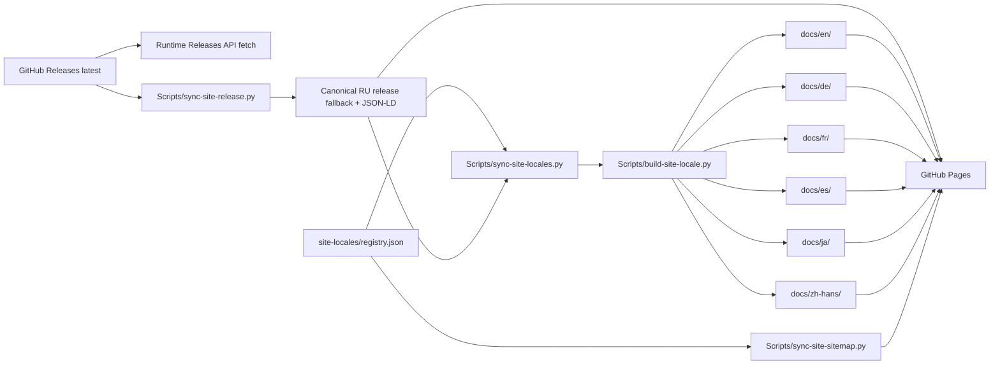

# Website Architecture

## Hosting boundary

`docs/` обслуживается GitHub Pages. Engineering knowledge base находится отдельно в `knowledge-base/`.

Маркетинговый сайт и локализации приложения — разные поверхности, но на текущем baseline их наборы совпадают. **Сайт имеет семь реальных статических языковых версий: RU (`/`), EN (`/en/`), DE (`/de/`), FR (`/fr/`), ES (`/es/`), JA (`/ja/`) и Simplified Chinese (`/zh-hans/`). Приложение Impuls 1.4.15 поддерживает те же семь языков интерфейса: `ru`, `en`, `de`, `fr`, `es`, `ja`, `zh-Hans`.** Это совпадение не означает, что website locales и app locales становятся одним контрактом: наборы могут снова разойтись при будущей поэтапной локализации.

## Canonical source and generated pages

`docs/index.html` — canonical RU content/layout source и self-contained production page: no external CSS/JS/fonts и no runtime localization dependency. Значения design system остаются в CSS этой страницы; intent описан в [Website Design System](design-system.md).

Публичный набор website-locales хранится в `Scripts/site-locales/registry.json`. Один `Scripts/build-site-locale.py` генерирует все non-default static pages:

```text
Scripts/site-locales/registry.json
              │
docs/index.html (RU source)
        │
        ├── en.json      ──> docs/en/index.html
        ├── de.json      ──> docs/de/index.html
        ├── fr.json      ──> docs/fr/index.html
        ├── es.json      ──> docs/es/index.html
        ├── ja.json      ──> docs/ja/index.html
        └── zh-Hans.json ──> docs/zh-hans/index.html
```

Все страницы кроме RU root **generated и не редактируются вручную**. Любой layout/content contract сначала меняется в canonical RU source или соответствующем locale config, затем pages регенерируются.

### Translation storage

DE, FR, ES, JA и zh-Hans — fully external website locales: user-facing strings, screenshot alt text, localized head metadata и localized JSON-LD copy живут в соответствующих `Scripts/site-locales/<locale>.json`.

English проходит через тот же generic builder и хранит head/JSON-LD metadata в `Scripts/site-locales/en.json`. На текущем migration baseline его body/alt dictionary всё ещё читается из существующих `EN`/`ALT` объектов canonical RU page через `source_dictionary` / `source_alt_dictionary`. Это transitional compatibility, а не разрешение снова создавать language-specific generators.

DE/FR/ES/JA/zh-Hans переводы подготовлены AI-assisted и прошли structural/technical review; native-speaker linguistic review пока не записан как выполненный. Это нельзя подменять утверждением о native review.

## Locale registry and routing owners

`Scripts/site-locales/registry.json` — canonical owner публичного locale cluster. Он задаёт для каждой опубликованной страницы:

- locale code;
- короткий label переключателя;
- URL path;
- OpenGraph locale.

**Locale code и URL path не обязаны совпадать.** Текущий важный пример: BCP-47 code `zh-Hans` публикуется по lowercase URL `/zh-hans/`. Generator, legacy routing, workflows, sitemap и tests обязаны читать path из registry, а не строить `docs/<code>/` или `<code>/` самостоятельно.

`Scripts/sync-site-locales.py` читает registry и синхронизирует canonical RU source:

- полный `hreflang` cluster (`ru`, `en`, `de`, `fr`, `es`, `ja`, `zh-Hans`, `x-default`);
- `og:locale` / `og:locale:alternate` cluster;
- `WebSite.inLanguage` для реально существующих public pages;
- видимый seven-locale selector;
- runtime labels для release metadata на generated pages;
- legacy `?lang=` navigation через registry path;
- responsive behavior language selector.

`Scripts/sync-site-sitemap.py` читает тот же registry и владеет locale entries в `docs/sitemap.xml`. Нельзя поддерживать второй ручной список языков в sitemap или workflow.

Оба sync-script deterministic и имеют `--check`. Generated page не должна сама решать, какие языки существуют.

## SEO contract

Каждая локаль — самостоятельная индексируемая страница со своим:

- `<html lang>`;
- title и meta description;
- self canonical;
- OpenGraph locale/title/description;
- Twitter title/description;
- localized `SoftwareApplication` и `FAQPage` JSON-LD;
- полным reciprocal `hreflang` cluster.

`x-default` остаётся RU root. `sitemap.xml` перечисляет каждую реальную public page. Locale попадает в registry только вместе с реальным static URL, self-canonical, sitemap projection и reciprocal hreflang.

Текущий baseline:

```text
website locales: ru, en, de, fr, es, ja, zh-Hans
app locales:     ru, en, de, fr, es, ja, zh-Hans
```

## Screenshots

RU page использует RU product captures, EN — EN captures. External locale configs `de.json`, `fr.json`, `es.json`, `ja.json` и `zh-Hans.json` сознательно задают `screenshot_locale: en`: body/head/alt локализованы, но продуктовые снимки остаются реальными английскими captures, пока отдельные наборы для этих языков не подготовлены. Нельзя рисовать fake localized UI вместо реального приложения.

Screenshot assets должны быть real product captures либо явно demo data. Нельзя публиковать личные данные, internal notes, реальные calendar events или identifiers.

## Release data



Version/download/SHA at runtime читаются из GitHub Releases API. Static markup уже содержит synchronized fallback для crawlers/no-JS и не является independent release source of truth.

`Scripts/sync-site-release.py` владеет `FALLBACK_RELEASE`, `[data-release]`, SHA-256, release fields JSON-LD и download links. Новый release не требует ручного редактирования каждой language page.

## Durable product facts

Нерелизные маркетинговые факты, которые должны переживать release sync, принадлежат `Scripts/sync-site-product-facts.py`.

Текущий localization product fact виден на каждой public locale:

- RU: `7 языков интерфейса`;
- EN: `7 interface languages`;
- DE: `7 Sprachen`;
- FR: `7 langues`;
- ES: `7 idiomas`;
- JA: `7 言語対応`;
- zh-Hans: `支持 7 种语言`;
- FAQ каждой страницы перечисляет все семь app-locales и System/manual language behavior.

RU/EN variants этого факта остаются в canonical RU source/embedded EN dictionary; остальные variants — в external locale configs. Если набор shipped app localizations меняется, нельзя исправить только число в generated HTML: необходимо обновить durable product fact, locale config(s), assertions и заново построить страницы.

## Site synchronization workflow

`.github/workflows/site-release-sync.yml` поддерживает static markup после release и после изменения website generators/configs.

Порядок:

1. `Scripts/sync-site-release.py` — version/download/SHA;
2. `Scripts/sync-site-product-facts.py` — durable product facts;
3. `Scripts/sync-site-locales.py` — locale routing/runtime cluster из registry;
4. `Scripts/sync-site-sitemap.py` — sitemap locale cluster из registry;
5. `Scripts/build-site-locale.py` запускается циклом для каждого non-default locale code из registry;
6. page path для checks/commit берётся из registry, отдельно от code;
7. все owners запускаются с `--check`, затем проверяются no-JS download, reciprocal `hreflang` и localization product facts;
8. bot коммитит только canonical/generated website markup и sitemap, если они реально изменились.

Workflow не является release path: не меняет `Scripts/version`, не подписывает, не тегирует приложение и не загружает app assets. Его bot commit затрагивает только `docs/`, а push-trigger смотрит на generators/configs, поэтому цикл невозможен.

## Adding a future website locale

Новый язык не должен приводить к `build-<locale>-page.py`, копии HTML или ручной поддержке отдельной страницы.

Минимальный contract:

1. создать `Scripts/site-locales/<locale>.json` с полной key parity и localized head/schema;
2. добавить locale ровно один раз в `Scripts/site-locales/registry.json`, явно задав code и public path;
3. расширить language-specific assertions/tests для нового текста;
4. запустить registry-driven sync/generator checks;
5. после публикации проверить layout и естественность текста, не объявляя native review без фактической вычитки.

`sync-site-locales.py`, `sync-site-sitemap.py`, `site-release-sync.yml` и generic builder не должны получать hardcoded branch для нового языка.

## No-JavaScript contract

Каждая static locale обязана быть полноценной без JavaScript:

- реальный DMG link;
- версия, размер, filename и SHA-256 в markup;
- localized body/head/FAQ/product facts;
- все модули видны стопкой, пока JS не построил selector;
- ни один content block не зависит от opacity/IntersectionObserver, чтобы быть читаемым.

Runtime JavaScript может освежить release metadata и включить interaction, но не является переводчиком для external locales.

## Themes and responsive behavior

Website follows `prefers-color-scheme`; отдельного theme toggle нет. Dark/light обязаны проверяться обе.

Seven-locale selector остаётся обычной статической навигацией, не JavaScript menu. До 699 px wordmark text скрывается, locale strip получает собственный horizontal scroll без скролла всей страницы, а Download остаётся отдельной доступной кнопкой. До 359 px скрывается и brand icon, чтобы язык и Download не вытеснялись за viewport. Все семь links остаются в DOM и доступны клавиатуре/скринридеру.

## Invariants

1. `docs/index.html` — canonical RU content/layout source.
2. `docs/en/`, `docs/de/`, `docs/fr/`, `docs/es/`, `docs/ja/`, `docs/zh-hans/` generated и не редактируются вручную.
3. Website-locales и app-locales — разные contracts, хотя на текущем baseline оба содержат семь одинаковых BCP-47 codes.
4. `Scripts/site-locales/registry.json` — единственный canonical список public website locales и их URL paths.
5. Один generic builder обслуживает все generated website locales; language-specific Python generator запрещён.
6. `sync-site-locales.py` владеет page locale cluster, `sync-site-sitemap.py` — sitemap projection; оба читают registry.
7. Нельзя строить filesystem/public path из locale code: использовать registry path.
8. Release metadata принадлежит `sync-site-release.py`; durable marketing facts — `sync-site-product-facts.py`.
9. Public locale существует только если есть real static URL, self-canonical, sitemap entry и reciprocal hreflang.
10. Все static pages полезны без JavaScript.
11. `site-release-sync.yml` публикует только website markup и не становится вторым app release workflow.

## Связано

- [Website Design System](design-system.md)
- [Version Statistics Collector](version-statistics-collector.md)
- [Settings, Onboarding and Feedback](../01-architecture/settings-onboarding-feedback.md)
- [Release Pipeline](../05-release/release-pipeline.md)
- `.claude/rules/website.md`
- `Scripts/sync-site-release.py`
- `Scripts/sync-site-product-facts.py`
- `Scripts/sync-site-locales.py`
- `Scripts/sync-site-sitemap.py`
- `Scripts/build-site-locale.py`
- `Scripts/site-locales/registry.json`
- `Scripts/site-locales/en.json`
- `Scripts/site-locales/de.json`
- `Scripts/site-locales/fr.json`
- `Scripts/site-locales/es.json`
- `Scripts/site-locales/ja.json`
- `Scripts/site-locales/zh-Hans.json`
- `.github/workflows/site-localization.yml`
- `.github/workflows/site-release-sync.yml`
