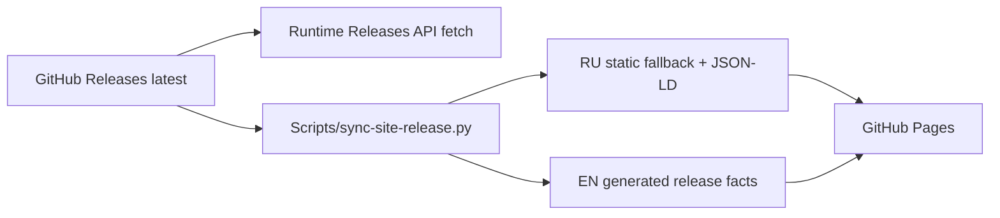

# Website Architecture

## Hosting boundary

`docs/` обслуживается GitHub Pages. Поэтому engineering knowledge base находится отдельно в `knowledge-base/`.

## Russian page

`docs/index.html` — self-contained production page: no external CSS/JS/fonts and no build step для основной RU page. Это deliberate performance/reliability contract.

## English page

English static page живёт в `docs/en/` и генерируется/проверяется `Scripts/build-en-page.py`, чтобы head/SEO/body не drift'или вручную.

## Release data

Version/download/SHA at runtime читаются из GitHub Releases API. Static markup содержит synchronized fallback для SEO/no-JS, но не является independent release source of truth.

CI/workflow сохраняет literal contracts вокруг `RELEASE_API`, `releaseHash(...)` и `data-conversion="feedback"`.

## Themes

Website follows `prefers-color-scheme`; отдельного theme toggle нет. Dark/light обязаны проверяться обе. Для gradient-clipped text theme overrides не должны использовать CSS `background` shorthand, который сбрасывает `background-clip`; используется `background-image`.

## SEO / privacy pages

`site-privacy.html`, `robots.txt`, `sitemap.xml`, manifest и RU/EN metadata должны оставаться согласованы. Новая public page требует sitemap review.

## Product screenshots

Screenshots должны быть real product captures либо явно demo data. Нельзя публиковать личные данные, internal notes, реальные calendar events или identifiers. Исторически screenshot leak уже был обнаружен, поэтому privacy review assets обязателен.

## Связано

- `.claude/rules/website.md`
- `Scripts/sync-site-release.py`
- `Scripts/build-en-page.py`
- [Release Pipeline](../05-release/release-pipeline.md)
