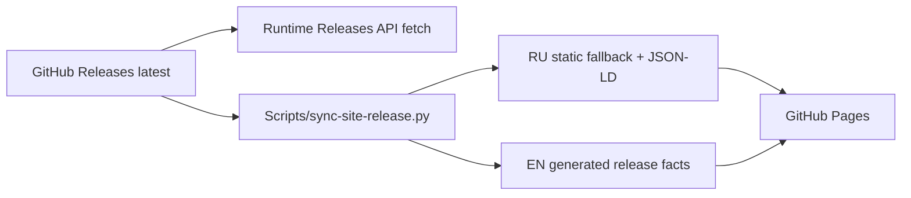

# Website Architecture

## Hosting boundary

`docs/` обслуживается GitHub Pages. Поэтому engineering knowledge base находится отдельно в `knowledge-base/`.

## Russian page

`docs/index.html` — self-contained production page: no external CSS/JS/fonts и no build step для основной RU page. Это deliberate performance/reliability contract.

Страница несёт свою design system внутри себя — единственный `<style>` в `<head>`. Принципы, токены, композиция глав, motion, responsive и accessibility описаны в [Website Design System](design-system.md); значения остаются в CSS страницы.

## English page

English static page живёт в `docs/en/` и генерируется/проверяется `Scripts/build-en-page.py`, чтобы head/SEO/body не drift'или вручную.

Скрипт переносит разметку RU page целиком и подменяет:

- содержимое элементов с `data-i` по словарю `EN` внутри RU page;
- `alt` продуктовых снимков по словарю `ALT`;
- пути `assets/screens/ru/` → `assets/screens/en/`;
- релизные строки, которые RU-разметка пишет по-русски (`Версия x.y.z`, `x,y МБ`);
- head/SEO/JSON-LD, у которых нет runtime-эквивалента;
- блок переключателя языка — сверяется буквально и роняет сборку при расхождении.

Отсюда следуют требования к разметке RU page: `data-i` не вкладываются друг в друга, не ставятся на void-теги, и не менее 80 % ключей `EN` должны находить свой элемент — иначе скрипт считает, что разметка разошлась со словарём, и падает.

RU и EN делят один `<style>`, поэтому layout и визуальная система у них идентичны по построению, а не по договорённости.

## Release data

Version/download/SHA at runtime читаются из GitHub Releases API. Static markup содержит synchronized fallback для SEO/no-JS, но не является independent release source of truth.

CI/workflow сохраняет literal contracts вокруг `RELEASE_API`, `releaseHash(...)` и `data-conversion="feedback"`.

`sync-site-release.py` переписывает страницу по якорям, а не по позициям: объект `FALLBACK_RELEASE`, элементы `[data-release="version-label"|"size"|"filename"]`, `<code id="hash">`, релизные поля JSON-LD и все ссылки `[data-conversion="download"]`. Количество кнопок скачивания — решение вёрстки, скрипт его не фиксирует; наличие якорей — фиксирует.

## Themes

Website follows `prefers-color-scheme`; отдельного theme toggle нет. Dark/light обязаны проверяться обе.

Светлая тема — база, тёмная — переопределение в `@media(prefers-color-scheme:dark)`. Такой порядок сохраняется намеренно: он позволяет проверить светлую тему удалением одного набора media-блоков из CSSOM, без смены системного оформления.

Для gradient-clipped text theme overrides не должны использовать CSS `background` shorthand, который сбрасывает `background-clip`; используется `background-image`. На текущей странице градиентного текста нет, правило остаётся для любого будущего элемента с этим приёмом.

## No-JavaScript contract

Страница обязана быть полноценной без скрипта:

- ссылки скачивания ведут на реальный DMG, а не на страницу релиза;
- версия, размер, имя файла и SHA-256 присутствуют в статической разметке;
- селектор модулей скрыт (`#rail` остаётся `hidden`), все модули показаны стопкой;
- ни один элемент не спрятан за `opacity` или за IntersectionObserver.

Последнее — не стилистика, а следствие трёх зафиксированных дефектов: невидимая без JS глава «Действия», блоки «Поведения», не выходившие из нижнего поля observer'а, и hero-панель, зависевшая от того, что CSS-анимация действительно проиграет. Действующее правило: анимируется только `transform`.

## SEO / privacy pages

`site-privacy.html`, `robots.txt`, `sitemap.xml`, manifest и RU/EN metadata должны оставаться согласованы. Новая public page требует sitemap review.

SEO-состав — title, description, canonical, hreflang, OpenGraph, Twitter, JSON-LD (`Person`, `WebSite`, `SoftwareApplication`, `FAQPage`) — считается утверждённым. Редизайн presentation layer его не переписывает.

## Product screenshots

Screenshots должны быть real product captures либо явно demo data. Нельзя публиковать личные данные, internal notes, реальные calendar events или identifiers. Исторически screenshot leak уже был обнаружен, поэтому privacy review assets обязателен.

Рисованный «продуктовый» UI вместо снимка запрещён отдельно: страница обещает, что показывает приложение.

Панель имеет пропорцию ≈ 2.7 : 1. На узких экранах кадр не сжимается до нечитаемой полосы, а держит минимальную ширину и скроллится внутри себя; страница вбок не едет никогда.

## Связано

- [Website Design System](design-system.md)
- [Version Statistics Collector](version-statistics-collector.md)
- [Release Pipeline](../05-release/release-pipeline.md)
- `.claude/rules/website.md`
- `Scripts/sync-site-release.py`
- `Scripts/build-en-page.py`
