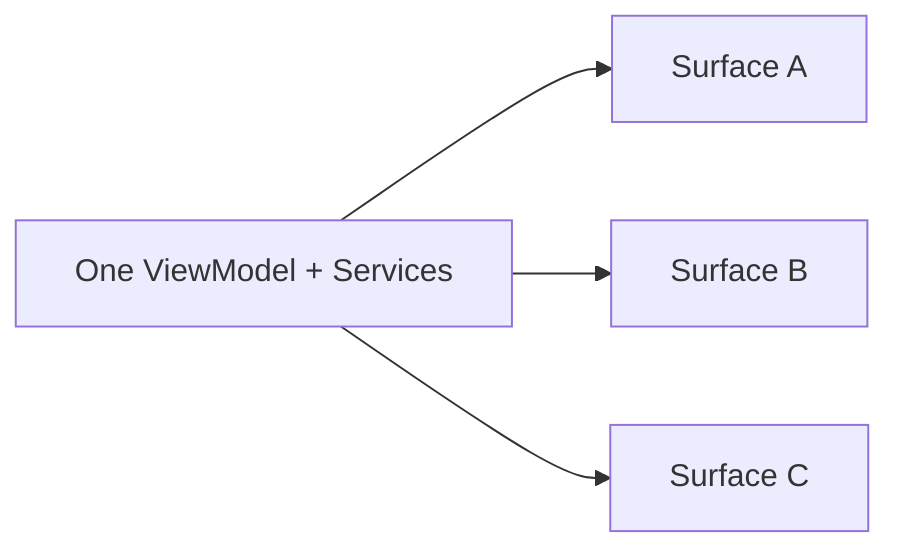

# ADR-002 — Shared Services, Per-Display Presentation

## Status

Accepted. Introduced by multi-display architecture and binding for current code.

## Context

ИМПУЛЬС должен быть доступен на нескольких displays, но stores/timers/providers представляют одно приложение и один набор пользовательских данных.

## Decision

Создавать один `NotchViewModel` на process. На каждый display создаётся только presentation surface (window/view/geometry). `DisplayCoordinator` не имеет stores/timers.

## Alternatives rejected

- ViewModel per display: duplicate clipboard/media/power monitors, diverging state, extra timers.
- Rebuild on screen parameter change: destroys user state and restarts services.

## Consequences

Hot unplug/reconcile не теряет Notes/Translate state. Surface code должен оставаться presentation-only. Exactly one active surface invariant обязателен.

## References

- [Multi-Display Architecture](../01-architecture/multi-display.md)
- `Sources/Impuls/Notch/DisplayCoordinator.swift`
- `Sources/Impuls/Notch/NotchController.swift`
