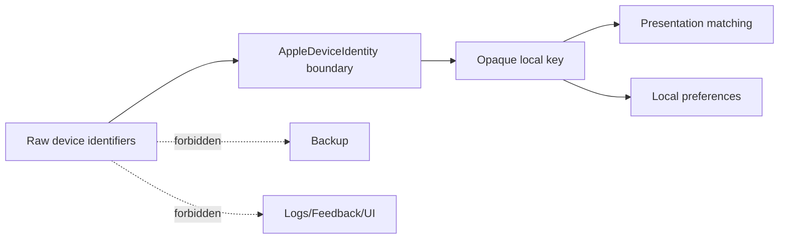

# ADR-004 — Local-Only Device Identity

## Status

Accepted.

## Context

Device layer должен deduplicate/remember presentation choices, но raw UDID, serial, Bluetooth address и pairing material слишком чувствительны для UI, logs, feedback, backup или portable settings.

## Decision

`AppleDeviceIdentity` является boundary. Presentation использует opaque/local derived key. Local ordering/hidden state и Menu Bar selected-device key остаются на конкретном Mac и исключаются из export backup.

## Consequences

Restored backup на другом Mac не пытается выбрать «тот же физический девайс». Это intentionally less portable, но честнее и безопаснее.
