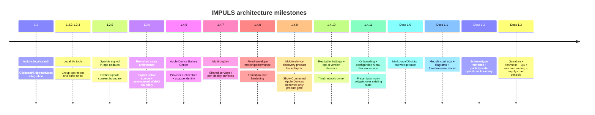

# Architecture Timeline

Это не полный changelog, а компактная карта архитектурных рубежей. Для machine-checked release evidence используй [Release Architecture Ledger](release-architecture-ledger.md).

Для user-facing деталей см. `docs/releases/`. Для причин — ADR и architecture pages. Для точной связи release → architecture → ADR → evidence — generated ledger.
