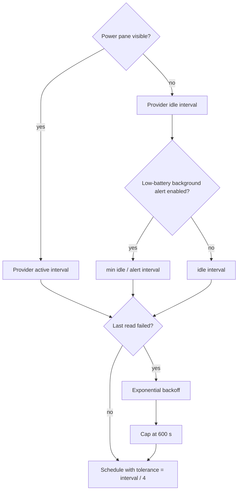

# Background Work & Concurrency Registry

This is the canonical registry of long-lived, periodic, delayed and off-main work in Impuls. It exists to keep a small menu-bar utility from gradually accumulating hidden timers, duplicated polling, unbounded tasks or main-thread I/O.

## Global rules

1. **Presentation must not multiply work.** A second display or Menu Bar surface reuses shared services; it does not create another store, timer, provider or network client.
2. **Attention controls cadence.** Expensive or frequent work should run only while somebody can see the result. When the panel folds, prefer events, a sparse idle cadence or no work.
3. **Slow I/O stays off `MainActor`.** Observable state may be main-actor isolated; disk, process, socket and device reads are not allowed to freeze it.
4. **Every long-lived owner has lifecycle.** Timers, observers, sockets and tasks created by `start()` must be invalidated/cancelled by `stop()` or by the state transition that made them unnecessary.
5. **Expensive reads are one-in-flight unless there is a proven reason otherwise.** Coalesce duplicate refresh requests instead of stacking identical work.
6. **Timer tolerance is intentional.** Background utility work should give macOS room to coalesce wake-ups. A new exact timer needs a user-visible reason.
7. **Synchronous durability is exceptional.** Blocking a serial writer queue is reserved for shutdown or explicit destructive transitions where losing the final state would be worse than a short wait.

## Runtime registry

| Owner | Work | Cadence / trigger | Execution / isolation | Stop / cancellation contract |
| --- | --- | --- | --- | --- |
| `PointerWatcher` | Shared pointer sampler for every display | warm: `1/60 s`; idle: `1/8 s`; rest after `3 s`; tolerance warm `interval/4`, idle `interval/2` | `@MainActor`, cheap `NSEvent.mouseLocation` sample | one timer total; `stop()` invalidates it; never one sampler per display |
| `ClipboardStore` | Pasteboard `changeCount` polling | `0.5 s`, tolerance `0.2 s`; payload is read only after the counter changes | `@MainActor`; normal tick is one integer read | `stop()` invalidates timer and flushes optional persistence |
| `ClipboardStore` | Delayed image availability retry | `0.5 s`, maximum 12 attempts for the same pasteboard generation | main queue delayed callback; generation protected by pasteboard `changeCount` | stops on generation change, successful image, fallback or attempt cap |
| `MediaController` | Playback-position ticker | `0.25 s`, tolerance `0.05 s`; only while playing and panel active | `@MainActor`; presentation-only arithmetic | invalidated when inactive, paused/empty or `stop()` |
| `MediaController` | Native Apple Music refresh | `1 s`, tolerance `0.15 s`; only active Apple Music pane | `@MainActor` coordinator; actual Apple Event work is delegated to `PlayerBridge` utility queue | invalidated when inactive/source changes/stop; in-flight refreshes coalesced with one pending flag |
| `PlayerBridge` | Apple Events / metadata / artwork work | event or refresh driven, no repeating timer | serial utility queue `io.tumanov.impuls.applescript`; callback returns to main | queue serializes work; permission prompt is explicit user action only |
| `CalendarStore` | Visible countdown tick | `30 s`, tolerance `5 s`; active pane only | `@MainActor` | `stopTimer()` when pane closes; EventKit change observer handles closed-state changes |
| `PowerMonitor` | Local Mac fast power refresh | `2 s`, tolerance `0.5 s`; only while Power is enabled and pane active | `@MainActor`; provider snapshot is bounded/local | timer stops when folded/disabled; IOKit observer remains the event path while enabled |
| `DeviceRefreshScheduler` | External-device provider polling | one timer per **polled provider**; active/idle cadence comes from provider; tolerance `interval/4` | `@MainActor` schedules; provider source reads are non-main async work | `stop()` invalidates every provider timer; event-driven providers never get a timer |
| `DeviceRefreshScheduler` | Failure backoff | doubles provider interval on consecutive failure, capped at `600 s` | scheduler state only | success resets failures; reschedule replaces prior timer |
| `AppleAccessoryBatteryProvider` | Accessory battery read | active `10 s`; idle `600 s`; plus IOKit/wake events | provider on MainActor; registry / `system_profiler` source reads leave MainActor | one `readTask`; duplicate refresh while busy is ignored; stop cancels task and observers |
| `MobileDeviceBatteryProvider` | iPhone/iPad battery read | active `60 s`; idle `900 s`; topology/wake may request immediate refresh | provider on MainActor; usbmuxd/lockdown source read is non-main async I/O | one `readTask`; one pending follow-up max; stop cancels task, topology monitor and wake observer |
| `TranslatePane` | Translation debounce | `320 ms` after typing pauses | SwiftUI `.task(id:)`; framework owns translation session | changing request cancels pending sleep; cancellation checked before session change |
| `NoteStore` | Notes persistence debounce | `800 ms` | delay on main, encode/write on serial utility queue `io.tumanov.impuls.notes.writer` | generation discards stale delayed saves; synchronous flush only during shutdown |
| `ClipboardHistoryPersistence` | Encrypted history persistence debounce | `750 ms` | serial utility writer queue protected by `NSLock`; AES-GCM and disk I/O off main | generation drops stale writes; `flush()` sync is shutdown durability path; disable/delete drains queue |
| `ScreenshotVault` | Screenshot save / usage / clear | event driven; at most 2 pending saves | serial utility queue `io.tumanov.impuls.screenshot-vault`; completions hop to MainActor | bounded pending counter supplies backpressure; no repeating work |
| `VersionTelemetryService` | Version heartbeat | no repeating app timer; send attempt throttled to once per `1 h` | async ephemeral `URLSession`; response bounded; service is not UI actor | no request without consent/endpoint; attempt time is persisted before suspension even for failure; request/resource timeout `10 s` |
| Sparkle updater | Update check scheduling | when user enables automatic checks, bundle schedule is `86400 s` | Sparkle-owned scheduler; `UpdateService` owns policy | default automatic checks/install remain off; user controls update setting |

## Provider cadence model

## MainActor boundary

`DeviceBatteryProviding` owns observable state on `MainActor`; `DeviceBatterySource` is deliberately non-isolated and `Sendable`. That split is a compile-time performance boundary: a USB/lockdown conversation that takes seconds must not become legal just because the provider publishing the result is an observable object.

The same design idea is used elsewhere:

- `PlayerBridge` serializes scripting work on a utility queue;
- notes and encrypted clipboard persistence use utility writer queues;
- screenshot file operations use a utility queue;
- callbacks hop back to `MainActor` only to publish/present state.

## Change protocol

Update this registry in the same change set when any of these change:

- a repeating `Timer`, polling interval or tolerance;
- a debounce/retry/delayed task;
- a long-lived `Task`, observer, topology listener or socket owner;
- a queue/actor boundary for disk, process, device or network I/O;
- cancellation/backpressure/one-in-flight behavior;
- a new background activity that survives while the panel is closed.

Then run `python3 Scripts/check-documentation-guardian.py --base <base-sha>` plus the normal knowledge-base and product CI.

## Performance invariant

A new display, Space, Menu Bar presentation or window is **not** permission to create another sampler/provider/service. A new always-on poller is an architectural performance change and needs an explicit rationale, lifecycle, cadence, tolerance, tests and documentation before it ships.
