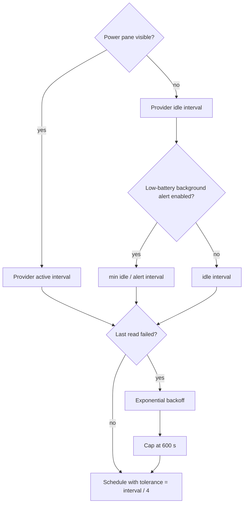

# Background Work & Concurrency Registry

This is the canonical registry of long-lived, periodic, delayed and off-main work in Impuls. It exists to keep a small menu-bar utility from gradually accumulating hidden timers, duplicated polling, unbounded tasks or main-thread I/O.

## Global rules

1. **Presentation must not multiply work.** A second display or Menu Bar surface reuses shared services; it does not create another store, timer, provider or network client.
2. **Attention controls cadence.** Expensive or frequent work should run only while somebody can see the result. When the panel folds, prefer events, a sparse idle cadence or no work.
3. **Slow I/O stays off `MainActor`.** Observable state may be main-actor isolated; disk, process, socket and device reads are not allowed to freeze it.
4. **Every long-lived owner has lifecycle.** Timers, observers, sockets and tasks created by `start()` must be invalidated/cancelled by `stop()` or by the state transition that made them unnecessary.
5. **Expensive reads are one-in-flight unless there is a proven reason otherwise.** Coalesce duplicate refresh requests instead of stacking identical work.
6. **Timer tolerance is intentional.** Background utility work should give macOS room to coalesce wake-ups. A new exact timer needs a user-visible reason.
7. **Synchronous durability is exceptional.** Blocking a serial writer queue is reserved for shutdown or explicit destructive transitions where losing the final state would be worse than a short wait.
8. **Bounded helpers stay bounded.** A one-shot lifecycle helper may outlive the process it is helping, but it must have an explicit termination bound and must not evolve into a daemon, LaunchAgent, login item or unbounded poller.

## Runtime registry

| Owner | Work | Cadence / trigger | Execution / isolation | Stop / cancellation contract |
| --- | --- | --- | --- | --- |
| `PointerWatcher` | Shared pointer sampler for every display | warm: `1/60 s`; idle: `1/8 s`; rest after `3 s`; tolerance warm `interval/4`, idle `interval/2` | `@MainActor`, cheap `NSEvent.mouseLocation` sample | one timer total; `stop()` invalidates it; never one sampler per display |
| `ClipboardStore` | Pasteboard `changeCount` polling | `0.5 s`, tolerance `0.2 s`; payload is read only after the counter changes | `@MainActor`; normal tick is one integer read | `stop()` invalidates timer and flushes optional persistence |
| `ClipboardStore` | Delayed image availability retry | `0.5 s`, maximum 12 attempts for the same pasteboard generation | main queue delayed callback; generation protected by pasteboard `changeCount` | stops on generation change, successful image, fallback or attempt cap |
| `MediaController` | Playback-position ticker | `0.25 s`, tolerance `0.05 s`; only while playing and panel active | `@MainActor`; presentation-only arithmetic | invalidated when inactive, paused/empty or `stop()` |
| `MediaController` | Native music refresh | `1 s`, tolerance `0.15 s`; only active selected Apple Music or Spotify pane | `@MainActor` coordinator; actual Apple Event work is delegated to `PlayerBridge` utility queue | one shared timer, invalidated when inactive/source changes/stop; in-flight refreshes coalesced with one pending flag; each fetch names the selected app, so no running-app scan or cross-adoption is possible; Apple Music notification fallback remains Apple-only |
| `PlayerBridge` | Apple Events / metadata / artwork work | event or refresh driven, no repeating timer | serial utility queue `io.tumanov.impuls.applescript`; callback returns to main | queue serializes work; permission prompt is explicit user action only |
| `CalendarStore` | Visible countdown tick | `30 s`, tolerance `5 s`; active pane only | `@MainActor` | `stopTimer()` when pane closes; EventKit change observer handles closed-state changes. Reviewed for IMP-21: local meeting-link path validation, including both Teams forms, adds neither timer, task, queue nor network work. |
| `PowerMonitor` | Local Mac fast power refresh | `2 s`, tolerance `0.5 s`; only while Power is enabled and pane active | `@MainActor`; provider snapshot is bounded/local | timer stops when folded/disabled; IOKit observer remains the event path while enabled |
| `DeviceRefreshScheduler` | External-device provider polling | one timer per **polled provider**; active/idle cadence comes from provider; tolerance `interval/4` | `@MainActor` schedules; provider source reads are non-main async work | `stop()` invalidates every provider timer; event-driven providers never get a timer |
| `DeviceRefreshScheduler` | Failure backoff | doubles provider interval on consecutive failure, capped at `600 s` | scheduler state only | success resets failures; reschedule replaces prior timer |
| `AppleAccessoryBatteryProvider` | Accessory battery read | active `10 s`; idle `600 s`; plus IOKit/wake events | provider on MainActor; registry / `system_profiler` source reads leave MainActor | one `readTask`; duplicate refresh while busy is ignored; stop cancels task and observers. The IOKit callback context is a retained `AccessoryNotificationContext` holding the provider **weakly**, never the provider itself: IOKit keeps the pointer for the life of the registration and cannot be told the provider has gone. Teardown invalidates the box first, then releases iterators and port, then releases the box on the main queue — the delivery queue, so FIFO puts it after any callback already waiting. `IONotificationPortSetDispatchQueue(port, nil)` is deliberately not used: `IOKitLib.h` documents no NULL behaviour for that parameter |
| `MobileDeviceBatteryProvider` | iPhone/iPad battery read | active `60 s`; idle `900 s`; topology/wake may request immediate refresh | provider on MainActor; usbmuxd/lockdown source read is non-main async I/O | one `readTask`; one pending follow-up max; stop cancels task, topology monitor and wake observer. **1.4.16:** a topology change or wake calls `refreshDiscardingInFlightRead()`, which cancels any in-flight `readTask` before starting a fresh one — an ordinary polling tick still only queues a follow-up behind it. This closes a real disconnect-during-read race: without it, a read started against a device that disconnects mid-read could complete and publish after the fact, briefly showing a gone device as live. No new timer/generation token — reuses the existing `Task.cancel()` + `Task.isCancelled` guard already in `refresh()` |
| `TranslatePane` | Translation debounce | `320 ms` after typing pauses | SwiftUI `.task(id:)`; framework owns translation session | changing request cancels pending sleep; cancellation checked before session change. **1.4.16 (#99):** `Translator.run(_:)`'s post-`await` checks now compare the full `Request` (text + pair + retry attempt), not only the pair — a stale answer for older text at the same pair is discarded the same way a pair change already was, rather than relying solely on `.translationTask`'s own (unverified) cancellation promptness |
| `Translator` | Supported-language list scan, then per-pair readiness scan | event driven: once per process (list), then on pair change and every Translate pane appearance (readiness) | both `LanguageAvailability` queries, on-device only, no network | **1.4.16 (#99):** `supportedLanguagesTask` guards the one-time list load against a second concurrent scan — `supported.isEmpty` alone did not rule one out while the first scan was still in flight. `availabilityTask?.cancel()` still guards the readiness scan the same way it did before; both checks stay lifecycle-driven (pair change, pane appearance), never a timer |
| `NoteStore` | Notes persistence debounce | `800 ms` | delay on main, encode/write on serial utility queue `io.tumanov.impuls.notes.writer` | generation discards stale delayed saves; synchronous flush only during shutdown |
| `ClipboardHistoryPersistence` | Encrypted history persistence debounce | `750 ms` | serial utility writer queue protected by `NSLock`; AES-GCM and disk I/O off main | generation drops stale writes; `flush()` sync is shutdown durability path; disable/delete drains queue. **Write latch:** a failed `load` blocks every write at `saveImmediately` — the single funnel for `save`, `writePendingItems` and `flush` alike — until a read succeeds; only the user-driven `delete()` passes it. `ClipboardStore.restoreFromArchive()` retries the read at configuration and stop, so recovery adds no background work |
| `ScreenshotVault` | Screenshot save / usage / clear | event driven; at most 2 pending saves | serial utility queue `io.tumanov.impuls.screenshot-vault`; completions hop to MainActor | bounded pending counter supplies backpressure; no repeating work |
| `BackupService` | Backup import read/decode and export encode/write | user-initiated, one per panel confirmation; no repeating work | `Task.detached(.userInitiated)` per operation. **1.4.16:** both directions previously ran inside the panel's `beginSheetModal` completion, which is main-actor code, so a slow or remote volume froze the panel. `decode(contentsOf:)` and `write(_:to:)` are now `nonisolated` and reached only through a detached task; `Task.detached` rather than a plain `Task { }` because this target builds in Swift 5 language mode, where an unstructured task created from a main-actor context is not guaranteed to leave it. `ImpulsBackupDocument` is a tree of value types and already implicitly `Sendable`, so no `@unchecked` conformance was added | no cancellation: an import/export runs to completion or throws. `NSOpenPanel`/`NSSavePanel`, `NSAlert` and the completion stay on `MainActor`; failures return there and reach the existing alerts. `BoundedFileReader` refuses non-regular files (`O_RDONLY | O_NONBLOCK` open, then `fstat` on the descriptor) because a byte budget bounds how much is read, never how long a read waits — a FIFO or socket would otherwise wait on a peer indefinitely. A slow *regular* file, such as one on an unresponsive network mount, still blocks the detached task for as long as the filesystem takes; that no longer freezes the UI, and no timeout is faked around an uninterruptible read |
| `VersionTelemetryService` | Version heartbeat | send attempt throttled to once per `(app version, 1 h)`; a version different from the last recorded attempt gets one immediate attempt regardless of when the previous version last tried | async ephemeral `URLSession`; response bounded; service is not UI actor | no request without consent/endpoint; attempt time **and** attempt version are persisted before suspension even for failure; request/resource timeout `10 s`. `diagnostics()` (1.4.16) is a synchronous read of the same locked `UserDefaults` state under the existing lock — no `Task`, no timer, no network call; a Settings pane calling it on `.onAppear`/refresh adds no new work to this owner |
| `VersionTelemetryScheduler` | Repeating proposal to attempt a version heartbeat | `1 h` (`VersionTelemetryService.heartbeatInterval`), tolerance `interval / 4`; first proposal comes from `AppDelegate`'s existing `+2 s` one-shot, this scheduler covers every proposal after that | `@MainActor` `Timer`; the actual attempt/throttle decision stays inside `VersionTelemetryService`, so a proposal that is not due yet is a no-op there | `stop()` invalidates the timer; `start()` is idempotent; `AppDelegate.applicationWillTerminate` stops it |
| Sparkle updater | Update check scheduling | when user enables automatic checks, bundle schedule is `86400 s` | Sparkle-owned scheduler; `UpdateService` owns policy | default automatic checks/install remain off; user controls update setting |
| `WebMusicPlayer` | Injected page bridge: state pump, DOM observer, pause verification | JS `setInterval` `1 s`; `MutationObserver` debounced `400 ms`; pause re-check `0.7 s` | runs inside the `WKWebView` content process; messages arrive on `MainActor` via `impulsMusic` | **`teardown()` is the stop path**, called from `MediaController.stop()`: bridge `stop()` clears both intervals and silences the observer, the script-message handler and user scripts are removed, the view is released. Idempotent, and it never builds a view or loads a URL. `deactivate()` only hides the window | **MainActor ownership (1.4.16, #113):** `@MainActor` sits on the **class**, not only on the `WebMusicPlaying` protocol. Conforming to a main-actor protocol isolates that protocol's own requirements and says nothing about the concrete state this object owns — the `WKWebView`, window controller, popup table, `currentState`, `source`, `requestedArtworkKey`, `playbackIntent`, `needsRecoveryLoad`, navigation callbacks, JS evaluation and teardown, all of which are AppKit/WebKit state that must stay on the main actor. `WebPlayerShowAction` beside it is a pure value and is deliberately **not** isolated. This is written down because the failure mode is silent: in this target's Swift 5 language mode, moving or deleting that attribute produces **no build error and no test failure** — it did happen once, when the attribute was accidentally attached to the enum instead of the class. There is no reliable compile-time guard for it, so the guard is review plus this entry.
| `ClipboardStore` | Pasteboard image decode / PNG re-encode | per pasteboard change carrying an image | serial `io.tumanov.impuls.clipboard.image-conversion` at `userInitiated`; pasteboard reads stay on `MainActor` | one image at a time; result discarded unless the pasteboard `changeCount` still matches; feeds the same 12-attempt retry. Representations are read in stages — PNG first, TIFF only if the PNG is unusable — so a large screenshot is not held twice |
| `SnippetStore` | Snippets persistence | on every mutation; no debounce — a snippet changes on a deliberate action, not per keystroke | serial utility queue `io.tumanov.impuls.snippets.writer` | generation drops stale writes; `reload()` will not read while a write is pending; `flushSynchronously()` is the shutdown durability path, called from `NotchViewModel.stop()` |
| `ShelfStore` | Restore sweep + QuickLook thumbnails | on `load()`; one thumbnail request per restored card | existence sweep on serial `io.tumanov.impuls.shelf.io`; `NSWorkspace.icon` stays on `MainActor` (AppKit promises it nowhere else) | only a later `load()` advances the generation, and a superseded sweep is discarded. A mutation does **not** retire the sweep — it used to, and the unrestored list then existed nowhere and was lost. While a restore runs the shelf is `items` plus `unrestoredPaths`, both are persisted together, user removals prune the tail, and the completion **reconciles** rather than assigns: files that vanished leave, what is still wanted is appended below cards added meanwhile. Appends are bounded by remaining room under `limit`, so icon and thumbnail fan-out stays capped by the limit and not by the defaults |
| `ImpulsActionsStore` | Folded search corpus | built on the first non-empty query, then reused | `@MainActor`; folding is the expensive part | invalidated by `clipboard`/`snippets`/`notes` `objectWillChange`, wired in `NotchViewModel`; a corpus whose size disagrees with its sources is rebuilt rather than trusted. **Not** rebuilt per keystroke |
| `MenuBarWorkspaceController` | Status item + menu rebuild | Combine fan-in over settings, power, devices and `media.objectWillChange`; effectively up to `4 Hz` while a track plays | `@MainActor`; status icon read once and cached | rebuild gated on `MenuBarMenuFingerprint`; `position` is deliberately excluded because the menu never shows it; `menuWillOpen` forces a rebuild. Lives for the process — not torn down by `NotchController.teardown()` |
| `MobileDeviceTopologyMonitor` | usbmuxd attach/detach listener | blocking socket read loop; reconnect backoff `1 s`, doubling to a `60 s` ceiling | `Task.detached(.utility)`; socket work never touches `MainActor` | `stop()` cancels the task **and** closes the fd; `deinit` calls `stop()`; unbounded in attempts by design, bounded in interval |
| `LowBatteryAlertService` | Background alert cadence override | `60 s` when a device is low and discharging, otherwise `300 s` | `@MainActor` policy only; feeds `DeviceRefreshScheduler` | returns `nil` when alerts are disabled, which removes the override entirely |
| `LowBatteryAlertService` | Notification authorization refresh and one-shot delivery attempts | authorization refresh on explicit enable/settings refresh; one async delivery per engine candidate; optional QA trigger is one-shot per process; **no delivery retry timer** | `@MainActor` owns the replaceable `permissionTask`; each candidate starts one short-lived async `UNUserNotificationCenter` delivery task, and both are `Task { @MainActor ... }` explicitly rather than relying on isolation inference — this target builds in Swift 5 language mode (`Package.swift`), which does not guarantee an unstructured `Task { }` created from a synchronous MainActor method inherits that isolation. `LowBatteryAlertEngine` holds only a process-local `deliveryID` while that boundary is in flight | a new authorization refresh cancels the previous `permissionTask`; deinit cancels it. Engine pending state prevents duplicate submissions for the same threshold. Delivery success confirms durable fired-state; failure cancels pending state, so only a later ordinary provider evaluation may retry. Disabling alerts adds no new work and does not create a retry loop |
| `SystemProfilerAccessorySource` | `system_profiler` subprocess | on accessory refresh, not on a timer of its own | `BoundedProcess`: two `DispatchQueue.global(.utility)` drains, fixed executable path, empty environment | `5 s` deadline then `terminate()` and `SIGKILL` after a grace period; stdout bounded to `1 MiB`, stderr `8 KiB`; truncation is an error, never a partial parse |
| `PowerAccessoryBatterySource` | One `/usr/bin/pmset -g accps -xml` run, for the battery overlay | **not on a cadence of its own** — runs inside an accessory refresh, and only when registry + `system_profiler` left a connected device with no reading. Everything already answered means no process at all | `BoundedProcess`: fixed absolute path, fixed arguments, no shell, empty environment, two `DispatchQueue.global(.utility)` drains. `@unchecked Sendable` for the same reason as `SystemProfilerAccessorySource`: the type holds one immutable `let` runner closure and no mutable state | `5 s` deadline then terminate, stdout bounded to `256 KiB`, stderr `8 KiB`, at most 32 parsed records. **Never throws**: a missing tool, non-zero exit, timeout, non-plist output or a changed schema all yield an empty overlay, so Power keeps the devices its other sources found and simply shows no extra battery. Nothing from stdout or stderr reaches a production log, and the accessory UUID is not parsed at all | **Off the main actor:** the caller is a `@MainActor` provider, so both accessory sources expose `async` non-isolated methods and run their subprocess *and* their parse inside `Task.detached(priority: .utility)`. A synchronous source method would spawn the tool on the main actor and freeze the UI until it answered or its deadline expired — that regression existed briefly in this branch and is now pinned by `AccessorySourceIsolationTests`. `Task.detached` does not inherit cancellation; the provider's existing `Task.isCancelled` guard before `publish` still discards a superseded result, and the work itself is bounded by the deadline |
| `NotchController` | Collapse-if-pointer-away, topology refresh | collapse check `0.6 s` after intent; topology refresh coalesced onto the next main turn | `@MainActor` delayed work items | generation counters discard superseded intents; `topologyRefreshWork` is cancelled by `teardown()`; sleep stops the pointer sampler, wake refreshes topology **before** restarting it |
| `AppDelegate` | Project-support prompt quiet deferral | none by default; one `+8 s` one-shot per quiet transition, and only when `ProjectSupportPromptService.isEligible` already holds | `@MainActor` `DispatchWorkItem` on the main queue | at most one item exists: it is created only by `NotchController.onReturnedToIdle`, cancelled when the user resumes work (`onMeaningfulUse`), cancelled in `applicationWillTerminate`, and cleared when it fires. Not a timer and not a poller — an ineligible or already-answered install schedules nothing at all, and the feature is capped at two presentations for the lifetime of the local state. The re-check when it fires covers this process only: `NSApp.windows` cannot see a system-owned permission dialog, so that case is a manual `SUP-01` obligation rather than a guarantee of this owner |
| `NotchController` | Return-to-idle signal | event driven; fires from the existing collapse completion, no work of its own | `@MainActor` | one report per folded session that contained deliberate use; the flag is cleared on delivery, on `teardown()` and on `foldImmediately()`, so a torn-down controller or a vanished display reports nothing |
| `AppDelegate` | Launch-time deferrals | update consent `+0.75 s`; version heartbeat first attempt `+2 s`, then starts `VersionTelemetryScheduler` for the hourly follow-ups | main queue delayed callbacks | one-shot deferrals; consent prompt is skipped under `CI=true`; neither opens a socket at launch, which CI verifies with `lsof`; the scheduler itself is stopped in `applicationWillTerminate` |
| `AppRelaunchService` | One-shot helper waits for the old Impuls PID, then reopens the exact bundle | explicit confirmed relaunch only; at most `100` liveness probes at `0.1 s` (≈`10 s`), then one `0.2 s` settle delay after the PID disappears | `AppRelaunchService` starts a detached `/bin/sh` child; the helper uses `kill -0` as a liveness probe and does no app-state I/O | exits after `open`, or exits fail-closed at the probe cap without opening anything. If helper launch fails, the old app stays alive. No daemon, Login Item or LaunchAgent survives the restart |
| `FileToolsCoordinator` | File batches and status auto-clear | user-initiated; status clears after `3 s` | `Task.detached(.userInitiated)` per item via `DetachedFileToolsWorkRunner`, `autoreleasepool` per item | status writes guarded by `statusGeneration`. **1.4.16 (#101):** one operation at a time — `beginOperation` takes a single slot and an `operationGeneration` guards every main-actor write a completing operation makes, so a superseded result cannot reach status, Shelf or Undo. Cancellation is **cooperative and explicit**: `Task.detached` inherits none, and the ImageIO/Vision work is synchronous, so a `FileToolsCancellation` flag is read at documented boundaries — between batch items, and between PDF pages. An item already in flight is allowed to finish rather than being abandoned mid-write; the remaining items never start. No timer, no polling, no extra concurrency: the batch stays sequential. The operation deliberately **survives** panel close — it is owned by the coordinator, which lives for the process — and is stopped only by the user's explicit Cancel |
| `NotchContentView` | Rail hover dwell | `150 ms` before a hover switches module | SwiftUI `.task(id:)` | id change cancels; hover is an affordance and must not become selection |
| Panes (`Actions`, `Clipboard`, `Notes`, `Snippets`, `Translate`) | "Copied" toast clear | `1.1 s` per pane | main queue delayed callback | value comparison discards a stale clear; no repeating work |

The 1.4.16 voluntary-support wiring does not add a runtime-registry owner. `AppDelegate`'s `onVoluntarySupport` callback is synchronous composition only: one typed destination is passed to the stateless browser opener after a click. It creates no `DispatchWorkItem`, `Task`, timer, poller or retry and performs no background request or preflight. The existing `projectSupportPromptWork` `+8 s` automatic-prompt contract above is unchanged.

## Provider cadence model

## MainActor boundary

`DeviceBatteryProviding` owns observable state on `MainActor`; `DeviceBatterySource` is deliberately non-isolated and `Sendable`. That split is a compile-time performance boundary: a USB/lockdown conversation that takes seconds must not become legal just because the provider publishing the result is an observable object.

The same design idea is used elsewhere:

- `PlayerBridge` serializes scripting work on a utility queue;
- notes, snippets and encrypted clipboard persistence use utility writer queues;
- screenshot file operations use a utility queue;
- clipboard image decoding and the shelf's restore sweep use their own serial queues;
- `BoundedProcess` drains subprocess output on global utility queues under a deadline;
- callbacks hop back to `MainActor` only to publish/present state.

`AppRelaunchService` is `@MainActor` for the orchestration call because starting a relaunch ends in `NSApp.terminate`. The wait itself is intentionally outside the terminating process in the one-shot helper. The UI actor never spins on PID liveness, and the helper's ≈10-second cap is the boundary preventing it from becoming hidden long-lived work.

Two things stay on `MainActor` on purpose, and both are recorded here so the next
reader does not "fix" them: `NSPasteboard` access, because AppKit does not promise it
off the main thread, and `NSWorkspace.icon(forFile:)`, for the same reason. In both
cases only that call remains — the decode, the re-encode and the existence sweep
around it were moved off.

## Change protocol

Update this registry in the same change set when any of these change:

- a repeating `Timer`, polling interval or tolerance;
- a debounce/retry/delayed task or bounded helper loop;
- a long-lived `Task`, observer, topology listener or socket owner;
- a queue/actor boundary for disk, process, device or network I/O;
- cancellation/backpressure/one-in-flight behavior;
- a new background activity that survives while the panel is closed.

Then run `python3 Scripts/check-documentation-guardian.py --base <base-sha>` plus the normal validation suite. If the change introduces or changes a cadence/count/timeout ceiling, review [Input & Resource Budget Registry](resource-budget-registry.md) in the same change set.
