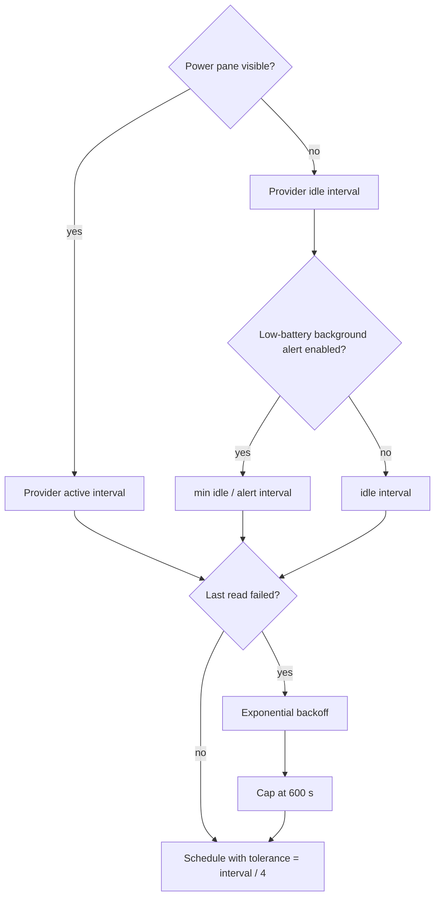

# Background Work & Concurrency Registry

This is the canonical registry of long-lived, periodic, delayed and off-main work in Impuls. It exists to keep a small menu-bar utility from gradually accumulating hidden timers, duplicated polling, unbounded tasks or main-thread I/O.

## Global rules

1. **Presentation must not multiply work.** A second display or Menu Bar surface reuses shared services; it does not create another store, timer, provider or network client.
2. **Attention controls cadence.** Expensive or frequent work should run only while somebody can see the result. When the panel folds, prefer events, a sparse idle cadence or no work.
3. **Slow I/O stays off `MainActor`.** Observable state may be main-actor isolated; disk, process, socket and device reads are not allowed to freeze it.
4. **Every long-lived owner has lifecycle.** Timers, observers, sockets and tasks created by `start()` must be invalidated/cancelled by `stop()` or by the state transition that made them unnecessary.
5. **Expensive reads are one-in-flight unless there is a proven reason otherwise.** Coalesce duplicate refresh requests instead of stacking identical work.
6. **Timer tolerance is intentional.** Background utility work should give macOS room to coalesce wake-ups. A new exact timer needs a user-visible reason.
7. **Synchronous durability is exceptional.** Blocking a serial writer queue is reserved for shutdown or explicit destructive transitions where losing the final state would be worse than a short wait.

## Runtime registry

| Owner | Work | Cadence / trigger | Execution / isolation | Stop / cancellation contract |
| --- | --- | --- | --- | --- |
| `PointerWatcher` | Shared pointer sampler for every display | warm: `1/60 s`; idle: `1/8 s`; rest after `3 s`; tolerance warm `interval/4`, idle `interval/2` | `@MainActor`, cheap `NSEvent.mouseLocation` sample | one timer total; `stop()` invalidates it; never one sampler per display |
| `ClipboardStore` | Pasteboard `changeCount` polling | `0.5 s`, tolerance `0.2 s`; payload is read only after the counter changes | `@MainActor`; normal tick is one integer read | `stop()` invalidates timer and flushes optional persistence |
| `ClipboardStore` | Delayed image availability retry | `0.5 s`, maximum 12 attempts for the same pasteboard generation | main queue delayed callback; generation protected by pasteboard `changeCount` | stops on generation change, successful image, fallback or attempt cap |
| `MediaController` | Playback-position ticker | `0.25 s`, tolerance `0.05 s`; only while playing and panel active | `@MainActor`; presentation-only arithmetic | invalidated when inactive, paused/empty or `stop()` |
| `MediaController` | Native Apple Music refresh | `1 s`, tolerance `0.15 s`; only active Apple Music pane | `@MainActor` coordinator; actual Apple Event work is delegated to `PlayerBridge` utility queue | invalidated when inactive/source changes/stop; in-flight refreshes coalesced with one pending flag |
| `PlayerBridge` | Apple Events / metadata / artwork work | event or refresh driven, no repeating timer | serial utility queue `io.tumanov.impuls.applescript`; callback returns to main | queue serializes work; permission prompt is explicit user action only |
| `CalendarStore` | Visible countdown tick | `30 s`, tolerance `5 s`; active pane only | `@MainActor` | `stopTimer()` when pane closes; EventKit change observer handles closed-state changes |
| `PowerMonitor` | Local Mac fast power refresh | `2 s`, tolerance `0.5 s`; only while Power is enabled and pane active | `@MainActor`; provider snapshot is bounded/local | timer stops when folded/disabled; IOKit observer remains the event path while enabled |
| `DeviceRefreshScheduler` | External-device provider polling | one timer per **polled provider**; active/idle cadence comes from provider; tolerance `interval/4` | `@MainActor` schedules; provider source reads are non-main async work | `stop()` invalidates every provider timer; event-driven providers never get a timer |
| `DeviceRefreshScheduler` | Failure backoff | doubles provider interval on consecutive failure, capped at `600 s` | scheduler state only | success resets failures; reschedule replaces prior timer |
| `AppleAccessoryBatteryProvider` | Accessory battery read | active `10 s`; idle `600 s`; plus IOKit/wake events | provider on MainActor; registry / `system_profiler` source reads leave MainActor | one `readTask`; duplicate refresh while busy is ignored; stop cancels task and observers. The IOKit callback context is a retained `AccessoryNotificationContext` holding the provider **weakly**, never the provider itself: IOKit keeps the pointer for the life of the registration and cannot be told the provider has gone. Teardown invalidates the box first, then releases iterators and port, then releases the box on the main queue — the delivery queue, so FIFO puts it after any callback already waiting. `IONotificationPortSetDispatchQueue(port, nil)` is deliberately not used: `IOKitLib.h` documents no NULL behaviour for that parameter |
| `MobileDeviceBatteryProvider` | iPhone/iPad battery read | active `60 s`; idle `900 s`; topology/wake may request immediate refresh | provider on MainActor; usbmuxd/lockdown source read is non-main async I/O | one `readTask`; one pending follow-up max; stop cancels task, topology monitor and wake observer |
| `TranslatePane` | Translation debounce | `320 ms` after typing pauses | SwiftUI `.task(id:)`; framework owns translation session | changing request cancels pending sleep; cancellation checked before session change |
| `NoteStore` | Notes persistence debounce | `800 ms` | delay on main, encode/write on serial utility queue `io.tumanov.impuls.notes.writer` | generation discards stale delayed saves; synchronous flush only during shutdown |
| `ClipboardHistoryPersistence` | Encrypted history persistence debounce | `750 ms` | serial utility writer queue protected by `NSLock`; AES-GCM and disk I/O off main | generation drops stale writes; `flush()` sync is shutdown durability path; disable/delete drains queue. **Write latch:** a failed `load` blocks every write at `saveImmediately` — the single funnel for `save`, `writePendingItems` and `flush` alike — until a read succeeds; only the user-driven `delete()` passes it. `ClipboardStore.restoreFromArchive()` retries the read at configuration and stop, so recovery adds no background work |
| `ScreenshotVault` | Screenshot save / usage / clear | event driven; at most 2 pending saves | serial utility queue `io.tumanov.impuls.screenshot-vault`; completions hop to MainActor | bounded pending counter supplies backpressure; no repeating work |
| `VersionTelemetryService` | Version heartbeat | send attempt throttled to once per `(app version, 1 h)`; a version different from the last recorded attempt gets one immediate attempt regardless of when the previous version last tried | async ephemeral `URLSession`; response bounded; service is not UI actor | no request without consent/endpoint; attempt time **and** attempt version are persisted before suspension even for failure; request/resource timeout `10 s` |
| `VersionTelemetryScheduler` | Repeating proposal to attempt a version heartbeat | `1 h` (`VersionTelemetryService.heartbeatInterval`), tolerance `interval / 4`; first proposal comes from `AppDelegate`'s existing `+2 s` one-shot, this scheduler covers every proposal after that | `@MainActor` `Timer`; the actual attempt/throttle decision stays inside `VersionTelemetryService`, so a proposal that is not due yet is a no-op there | `stop()` invalidates the timer; `start()` is idempotent; `AppDelegate.applicationWillTerminate` stops it |
| Sparkle updater | Update check scheduling | when user enables automatic checks, bundle schedule is `86400 s` | Sparkle-owned scheduler; `UpdateService` owns policy | default automatic checks/install remain off; user controls update setting |
| `WebMusicPlayer` | Injected page bridge: state pump, DOM observer, pause verification | JS `setInterval` `1 s`; `MutationObserver` debounced `400 ms`; pause re-check `0.7 s` | runs inside the `WKWebView` content process; messages arrive on `MainActor` via `impulsMusic` | **`teardown()` is the stop path**, called from `MediaController.stop()`: bridge `stop()` clears both intervals and silences the observer, the script-message handler and user scripts are removed, the view is released. Idempotent, and it never builds a view or loads a URL. `deactivate()` only hides the window |
| `ClipboardStore` | Pasteboard image decode / PNG re-encode | per pasteboard change carrying an image | serial `io.tumanov.impuls.clipboard.image-conversion` at `userInitiated`; pasteboard reads stay on `MainActor` | one image at a time; result discarded unless the pasteboard `changeCount` still matches; feeds the same 12-attempt retry. Representations are read in stages — PNG first, TIFF only if the PNG is unusable — so a large screenshot is not held twice |
| `SnippetStore` | Snippets persistence | on every mutation; no debounce — a snippet changes on a deliberate action, not per keystroke | serial utility queue `io.tumanov.impuls.snippets.writer` | generation drops stale writes; `reload()` will not read while a write is pending; `flushSynchronously()` is the shutdown durability path, called from `NotchViewModel.stop()` |
| `ShelfStore` | Restore sweep + QuickLook thumbnails | on `load()`; one thumbnail request per restored card | existence sweep on serial `io.tumanov.impuls.shelf.io`; `NSWorkspace.icon` stays on `MainActor` (AppKit promises it nowhere else) | only a later `load()` advances the generation, and a superseded sweep is discarded. A mutation does **not** retire the sweep — it used to, and the unrestored list then existed nowhere and was lost. While a restore runs the shelf is `items` plus `unrestoredPaths`, both are persisted together, user removals prune the tail, and the completion **reconciles** rather than assigns: files that vanished leave, what is still wanted is appended below cards added meanwhile. Appends are bounded by remaining room under `limit`, so icon and thumbnail fan-out stays capped by the limit and not by the defaults |
| `ImpulsActionsStore` | Folded search corpus | built on the first non-empty query, then reused | `@MainActor`; folding is the expensive part | invalidated by `clipboard`/`snippets`/`notes` `objectWillChange`, wired in `NotchViewModel`; a corpus whose size disagrees with its sources is rebuilt rather than trusted. **Not** rebuilt per keystroke |
| `MenuBarWorkspaceController` | Status item + menu rebuild | Combine fan-in over settings, power, devices and `media.objectWillChange`; effectively up to `4 Hz` while a track plays | `@MainActor`; status icon read once and cached | rebuild gated on `MenuBarMenuFingerprint`; `position` is deliberately excluded because the menu never shows it; `menuWillOpen` forces a rebuild. Lives for the process — not torn down by `NotchController.teardown()` |
| `MobileDeviceTopologyMonitor` | usbmuxd attach/detach listener | blocking socket read loop; reconnect backoff `1 s`, doubling to a `60 s` ceiling | `Task.detached(.utility)`; socket work never touches `MainActor` | `stop()` cancels the task **and** closes the fd; `deinit` calls `stop()`; unbounded in attempts by design, bounded in interval |
| `LowBatteryAlertService` | Background alert cadence override | `60 s` when a device is low and discharging, otherwise `300 s` | `@MainActor` policy only; feeds `DeviceRefreshScheduler` | returns `nil` when alerts are disabled, which removes the override entirely |
| `SystemProfilerAccessorySource` | `system_profiler` subprocess | on accessory refresh, not on a timer of its own | `BoundedProcess`: two `DispatchQueue.global(.utility)` drains, fixed executable path, empty environment | `5 s` deadline then `terminate()` and `SIGKILL` after a grace period; stdout bounded to `1 MiB`, stderr `8 KiB`; truncation is an error, never a partial parse |
| `NotchController` | Collapse-if-pointer-away, topology refresh | collapse check `0.6 s` after intent; topology refresh coalesced onto the next main turn | `@MainActor` delayed work items | generation counters discard superseded intents; `topologyRefreshWork` is cancelled by `teardown()`; sleep stops the pointer sampler, wake refreshes topology **before** restarting it |
| `AppDelegate` | Project-support prompt quiet deferral | none by default; one `+8 s` one-shot per quiet transition, and only when `ProjectSupportPromptService.isEligible` already holds | `@MainActor` `DispatchWorkItem` on the main queue | at most one item exists: it is created only by `NotchController.onReturnedToIdle`, cancelled when the user resumes work (`onMeaningfulUse`), cancelled in `applicationWillTerminate`, and cleared when it fires. Not a timer and not a poller — an ineligible or already-answered install schedules nothing at all, and the feature is capped at two presentations for the lifetime of the local state |
| `NotchController` | Return-to-idle signal | event driven; fires from the existing collapse completion, no work of its own | `@MainActor` | one report per folded session that contained deliberate use; the flag is cleared on delivery, on `teardown()` and on `foldImmediately()`, so a torn-down controller or a vanished display reports nothing |
| `AppDelegate` | Launch-time deferrals | update consent `+0.75 s`; version heartbeat first attempt `+2 s`, then starts `VersionTelemetryScheduler` for the hourly follow-ups | main queue delayed callbacks | one-shot deferrals; consent prompt is skipped under `CI=true`; neither opens a socket at launch, which CI verifies with `lsof`; the scheduler itself is stopped in `applicationWillTerminate` |
| `FileToolsCoordinator` | File batches and status auto-clear | user-initiated; status clears after `3 s` | `Task.detached(.userInitiated)` per batch, `autoreleasepool` per item | status writes guarded by a generation. **Known gap:** batch tasks keep no handle, so they are not cancelled on teardown — see `09-known-issues/current-limitations.md` |
| `NotchContentView` | Rail hover dwell | `150 ms` before a hover switches module | SwiftUI `.task(id:)` | id change cancels; hover is an affordance and must not become selection |
| Panes (`Actions`, `Clipboard`, `Notes`, `Snippets`, `Translate`) | "Copied" toast clear | `1.1 s` per pane | main queue delayed callback | value comparison discards a stale clear; no repeating work |

## Provider cadence model

## MainActor boundary

`DeviceBatteryProviding` owns observable state on `MainActor`; `DeviceBatterySource` is deliberately non-isolated and `Sendable`. That split is a compile-time performance boundary: a USB/lockdown conversation that takes seconds must not become legal just because the provider publishing the result is an observable object.

The same design idea is used elsewhere:

- `PlayerBridge` serializes scripting work on a utility queue;
- notes, snippets and encrypted clipboard persistence use utility writer queues;
- screenshot file operations use a utility queue;
- clipboard image decoding and the shelf's restore sweep use their own serial queues;
- `BoundedProcess` drains subprocess output on global utility queues under a deadline;
- callbacks hop back to `MainActor` only to publish/present state.

Two things stay on `MainActor` on purpose, and both are recorded here so the next
reader does not "fix" them: `NSPasteboard` access, because AppKit does not promise it
off the main thread, and `NSWorkspace.icon(forFile:)`, for the same reason. In both
cases only that call remains — the decode, the re-encode and the existence sweep
around it were moved off.

## Change protocol

Update this registry in the same change set when any of these change:

- a repeating `Timer`, polling interval or tolerance;
- a debounce/retry/delayed task;
- a long-lived `Task`, observer, topology listener or socket owner;
- a queue/actor boundary for disk, process, device or network I/O;
- cancellation/backpressure/one-in-flight behavior;
- a new background activity that survives while the panel is closed.

Then run `python3 Scripts/check-documentation-guardian.py --base <base-sha>` plus the normal knowledge-base and product CI.

## Performance invariant

A new display, Space, Menu Bar presentation or window is **not** permission to create another sampler/provider/service. A new always-on poller is an architectural performance change and needs an explicit rationale, lifecycle, cadence, tolerance, tests and documentation before it ships.
