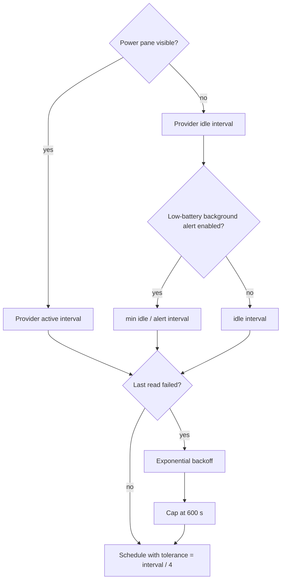

# Background Work & Concurrency Registry

This is the canonical registry of long-lived, periodic, delayed and off-main work in Impuls. It exists to keep a small menu-bar utility from gradually accumulating hidden timers, duplicated polling, unbounded tasks or main-thread I/O.

## Global rules

1. **Presentation must not multiply work.** A second display or Menu Bar surface reuses shared services; it does not create another store, timer, provider or network client.
2. **Attention controls cadence.** Expensive or frequent work should run only while somebody can see the result. When the panel folds, prefer events, a sparse idle cadence or no work.
3. **Slow I/O stays off `MainActor`.** Observable state may be main-actor isolated; disk, process, socket and device reads are not allowed to freeze it.
4. **Every long-lived owner has lifecycle.** Timers, observers, sockets and tasks created by `start()` must be invalidated/cancelled by `stop()` or by the state transition that made them unnecessary.
5. **Expensive reads are one-in-flight unless there is a proven reason otherwise.** Coalesce duplicate refresh requests instead of stacking identical work.
6. **Timer tolerance is intentional.** Background utility work should give macOS room to coalesce wake-ups. A new exact timer needs a user-visible reason.
7. **Synchronous durability is exceptional.** Blocking a serial writer queue is reserved for shutdown or explicit destructive transitions where losing final state would be worse than a short wait.
8. **One-shot helpers stay one-shot.** A bounded lifecycle helper must not silently become a daemon, LaunchAgent, login item or unbounded poller.

## Runtime registry

| Owner | Work | Cadence / trigger | Execution / isolation | Stop / cancellation contract |
| --- | --- | --- | --- | --- |
| `PointerWatcher` | Shared pointer sampler for every display | warm: `1/60 s`; idle: `1/8 s`; rest after `3 s`; tolerance warm `interval/4`, idle `interval/2` | `@MainActor`, cheap `NSEvent.mouseLocation` sample | one timer total; `stop()` invalidates it; never one sampler per display |
| `ClipboardStore` | Pasteboard `changeCount` polling | `0.5 s`, tolerance `0.2 s`; payload is read only after the counter changes | `@MainActor`; normal tick is one integer read | `stop()` invalidates timer and flushes optional persistence |
| `ClipboardStore` | Delayed image availability retry | `0.5 s`, maximum 12 attempts for the same pasteboard generation | main queue delayed callback; generation protected by pasteboard `changeCount` | stops on generation change, successful image, fallback or attempt cap |
| `MediaController` | Playback-position ticker | `0.25 s`, tolerance `0.05 s`; only while playing and panel active | `@MainActor`; presentation-only arithmetic | invalidated when inactive, paused/empty or `stop()` |
| `MediaController` | Native Apple Music refresh | `1 s`, tolerance `0.15 s`; only active Apple Music pane | `@MainActor` coordinator; Apple Event work is delegated to `PlayerBridge` utility queue | invalidated when inactive/source changes/stop; one pending refresh max |
| `PlayerBridge` | Apple Events / metadata / artwork work | event or refresh driven, no repeating timer | serial utility queue `io.tumanov.impuls.applescript`; callback returns to main | queue serializes work; permission prompt is explicit user action only |
| `CalendarStore` | Visible countdown tick | `30 s`, tolerance `5 s`; active pane only | `@MainActor` | `stopTimer()` when pane closes; EventKit observer handles closed-state changes |
| `PowerMonitor` | Local Mac fast power refresh | `2 s`, tolerance `0.5 s`; only while Power is enabled and pane active | `@MainActor`; provider snapshot is bounded/local | timer stops when folded/disabled; IOKit observer remains event path while enabled |
| `DeviceRefreshScheduler` | External-device provider polling | one timer per **polled provider**; active/idle cadence comes from provider; tolerance `interval/4` | `@MainActor` schedules; source reads are non-main async work | `stop()` invalidates provider timers; event-driven providers never get a timer |
| `DeviceRefreshScheduler` | Failure backoff | doubles provider interval on consecutive failure, capped at `600 s` | scheduler state only | success resets failures; reschedule replaces prior timer |
| `AppleAccessoryBatteryProvider` | Accessory battery read | active `10 s`; idle `600 s`; plus IOKit/wake events | provider on MainActor; registry / `system_profiler` reads leave MainActor | one `readTask`; duplicate refresh while busy is ignored; stop cancels task and observers |
| `MobileDeviceBatteryProvider` | iPhone/iPad battery read | active `60 s`; idle `900 s`; topology/wake may request immediate refresh | provider on MainActor; usbmuxd/lockdown source read is non-main async I/O | one `readTask`; one pending follow-up max; stop cancels task, topology monitor and wake observer |
| `TranslatePane` | Translation debounce | `320 ms` after typing pauses | SwiftUI `.task(id:)`; framework owns translation session | changing request cancels pending sleep; cancellation checked before session change |
| `NoteStore` | Notes persistence debounce | `800 ms` | delay on main, encode/write on serial utility queue `io.tumanov.impuls.notes.writer` | generation discards stale delayed saves; synchronous flush only during shutdown |
| `ClipboardHistoryPersistence` | Encrypted history persistence debounce | `750 ms` | serial utility writer queue protected by `NSLock`; AES-GCM and disk I/O off main | generation drops stale writes; `flush()` sync is shutdown durability path; failed load latches writes until recovery or explicit delete |
| `ScreenshotVault` | Screenshot save / usage / clear | event driven; at most 2 pending saves | serial utility queue `io.tumanov.impuls.screenshot-vault`; completions hop to MainActor | bounded pending counter supplies backpressure; no repeating work |
| `VersionTelemetryService` | Version heartbeat | send attempt throttled to once per `(app version, 1 h)`; a different version gets one immediate attempt | async ephemeral `URLSession`; response bounded | no request without consent/endpoint; attempt time/version persisted before suspension; request/resource timeout `10 s` |
| `VersionTelemetryScheduler` | Repeating proposal to attempt a version heartbeat | `1 h`, tolerance `interval / 4`; first proposal comes from AppDelegate's existing `+2 s` one-shot | `@MainActor` `Timer`; actual attempt/throttle decision stays in `VersionTelemetryService` | `stop()` invalidates timer; `start()` idempotent; AppDelegate stops it at termination |
| Sparkle updater | Update check scheduling | when user enables automatic checks, bundle schedule is `86400 s` | Sparkle-owned scheduler; `UpdateService` owns policy | default automatic checks/install remain off; user controls setting |
| `WebMusicPlayer` | Injected page bridge: state pump, DOM observer, pause verification | JS `setInterval` `1 s`; `MutationObserver` debounced `400 ms`; pause re-check `0.7 s` | `WKWebView` content process; messages arrive on `MainActor` | `teardown()` clears intervals/observer/handler/scripts and releases view; idempotent |
| `ClipboardStore` | Pasteboard image decode / PNG re-encode | per pasteboard change carrying an image | serial `io.tumanov.impuls.clipboard.image-conversion` at `userInitiated`; pasteboard reads stay on `MainActor` | one image at a time; stale-generation result discarded; representations read in stages |
| `SnippetStore` | Snippets persistence | on every deliberate mutation; no debounce | serial utility queue `io.tumanov.impuls.snippets.writer` | generation drops stale writes; synchronous shutdown flush from `NotchViewModel.stop()` |
| `ShelfStore` | Restore sweep + QuickLook thumbnails | on `load()`; one thumbnail request per restored card | existence sweep on serial `io.tumanov.impuls.shelf.io`; `NSWorkspace.icon` stays on `MainActor` | generation protects reload; completion reconciles with mutations and clamps to shelf limit |
| `ImpulsActionsStore` | Folded search corpus | built on first non-empty query, reused until source change | `@MainActor`; folding is the expensive part | invalidated by clipboard/snippets/notes `objectWillChange`; not rebuilt per keystroke |
| `MenuBarWorkspaceController` | Status item + menu rebuild | Combine fan-in; effectively up to `4 Hz` while track plays | `@MainActor`; status icon cached | rebuild gated on `MenuBarMenuFingerprint`; `position` excluded; process-lifetime owner |
| `MobileDeviceTopologyMonitor` | usbmuxd attach/detach listener | blocking socket read loop; reconnect backoff `1 s` doubling to `60 s` | `Task.detached(.utility)` | `stop()` cancels task and closes fd; unbounded attempts, bounded interval |
| `LowBatteryAlertService` | Background alert cadence override | `60 s` when low/discharging, otherwise `300 s` | `@MainActor` policy only; feeds scheduler | returns `nil` when disabled, removing override |
| `SystemProfilerAccessorySource` | `system_profiler` subprocess | on accessory refresh, no timer of its own | `BoundedProcess`; utility drains, fixed executable, empty environment | `5 s` deadline then terminate/SIGKILL grace; stdout `1 MiB`, stderr `8 KiB`; truncation is error |
| `NotchController` | Collapse-if-pointer-away, topology refresh | collapse check `0.6 s` after intent; topology refresh coalesced to next main turn | `@MainActor` delayed work items | generations discard superseded intents; teardown cancels topology work; sleep stops pointer sampler |
| `AppDelegate` | Project-support prompt quiet deferral | one `+8 s` one-shot per eligible quiet transition | `@MainActor` `DispatchWorkItem` | at most one; cancelled on resumed work/termination; cleared after fire; not timer/poller |
| `NotchController` | Project-support return-to-idle signal | event driven from existing collapse completion | `@MainActor` | one report per folded session containing deliberate use; cleared on delivery/teardown/immediate fold |
| `AppDelegate` | Launch-time deferrals | update consent `+0.75 s`; first version heartbeat `+2 s` | main queue delayed callbacks | one-shot; scheduler handles later telemetry proposals and is stopped on termination |
| `AppRelaunchService` | One-shot helper waits for old Impuls PID, then reopens exact bundle | explicit confirmed relaunch only; maximum `100` liveness probes at `0.1 s` (≈`10 s`), then `0.2 s` teardown settle | detached `/bin/sh` child; `kill -0` probes process liveness; helper performs no app-state I/O | exits immediately after `open`, or exits fail-closed at the probe cap without opening; no daemon, Login Item or LaunchAgent; if helper cannot start, old app stays running |
| `FileToolsCoordinator` | File batches and status auto-clear | user initiated; status clears after `3 s` | `Task.detached(.userInitiated)` per batch, `autoreleasepool` per item | status writes generation guarded; batch tasks currently lack teardown cancellation handle |
| `NotchContentView` | Rail hover dwell | `150 ms` before hover switches module | SwiftUI `.task(id:)` | id change cancels; hover is affordance, not selection |
| Panes (`Actions`, `Clipboard`, `Notes`, `Snippets`, `Translate`) | "Copied" toast clear | `1.1 s` per pane | main queue delayed callback | value comparison discards stale clear; no repeating work |

## Provider cadence model

## MainActor boundary

`DeviceBatteryProviding` owns observable state on `MainActor`; `DeviceBatterySource` is deliberately non-isolated and `Sendable`. Disk, process, socket and device work that can block stays outside the UI actor and callbacks return only to publish state.

`AppRelaunchService` itself is `@MainActor` because the user-confirmed relaunch and `NSApp.terminate` are application lifecycle operations. The waiting loop is deliberately outside the terminating process in a short-lived helper. That distinction is part of the contract: the UI actor never spins for the old PID, and the helper cannot become a permanent background agent.

Two AppKit calls remain on `MainActor` intentionally: `NSPasteboard` access and `NSWorkspace.icon(forFile:)`, because AppKit does not promise those APIs off the main thread. Heavy decode/existence work around them is moved away from the actor.

## Change protocol

Update this registry in the same change set when any of these change:

- a repeating timer, polling interval or tolerance;
- a debounce/retry/delayed task or bounded helper loop;
- a long-lived task, observer, topology listener or socket owner;
- a queue/actor boundary for disk, process, device or network I/O;
- cancellation/backpressure/one-in-flight behavior;
- a new background activity that survives while the panel is closed.

Then run `python3 Scripts/check-documentation-guardian.py --base <base-sha>`, `python3 Scripts/check-documentation-freshness.py` and the normal test/CI suite. A new or expanded cadence/timeout/count must also be reviewed against [Input & Resource Budget Registry](resource-budget-registry.md).
