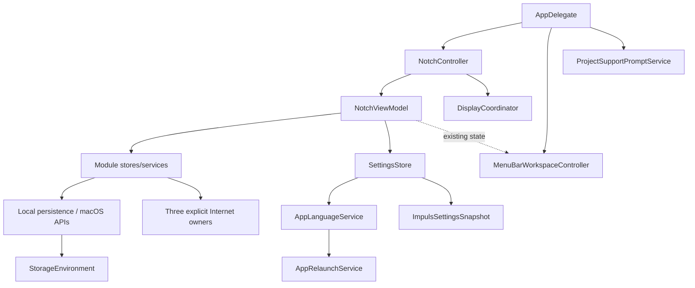

# Core Type Reference

## Purpose

This document is a compact ownership reference for the types that define Impuls' architectural boundaries. It is not generated API documentation and does not list every property. Instead it records **what a type owns, what it must not own, and where to verify its contract**.

For direct source/test links use the CI-checked [Generated Type → Tests → Docs Map](generated-type-test-doc-map.md).

## Ownership overview

The important distinction is **owner vs client**. A UI pane or Menu Bar surface renders state and sends intent; it should not quietly become a second owner of storage, network access, timers or hardware discovery. Language selection, process relaunch and project-support eligibility are likewise explicit owners rather than incidental Settings-window behavior.

## Application and presentation

### `AppDelegate`

**Role:** process-level composition root.

Owns creation/wiring of process-level controllers and services, launch deferrals and teardown order. It coordinates `NotchController`, update/version-statistics policy, auxiliary windows and the quiet-moment hand-off for project support.

**Must not:** contain module business logic or become a duplicate persistence layer.

Canonical docs: [Application Lifecycle](../01-architecture/application-lifecycle.md), [State and Ownership](../01-architecture/state-and-ownership.md).

### `NotchController`

**Role:** presentation orchestration across displays.

Owns one shared `NotchViewModel` lifetime, display reconciliation and active-surface selection, pointer integration, open/close transition intent, foreground service activation, keyboard claim ownership and the deliberate-use / return-to-idle signals used by the project-support lifecycle.

**Must not:** rebuild shared services when display topology changes or decide project-support eligibility.

Canonical docs: [Multi-Display](../01-architecture/multi-display.md), [State and Ownership](../01-architecture/state-and-ownership.md).

### `DisplayCoordinator`

**Role:** owns the set of live presentation surfaces and exactly one active display.

It reconciles add/update/remove topology without owning application state or services.

**Invariant:** there is no instant in which two surfaces consider themselves active.

Canonical docs: [Multi-Display](../01-architecture/multi-display.md).

### `NotchGeometry`

**Role:** deterministic geometry contract for one display/panel configuration.

It converts display descriptors and panel-size policy into collapsed/expanded frame geometry. Geometry should remain pure enough to test without live windows.

Canonical docs: [Multi-Display](../01-architecture/multi-display.md).

### `AppLanguageService`

**Role:** the single owner of the interface-language preference.

It owns `app.language.v1`, validates selectable bundle localizations, performs the explicit app-domain `AppleLanguages` override and reports whether the running process needs a relaunch. `SettingsStore` holds the service by composition and must not mirror the selected language into a second setting.

**Must not:** mutate language state merely by reading it, replace `Bundle.main`, or pretend the running process can be switched partially in place.

Canonical docs: [Localization](../04-development/localization.md), [Schema & Migration Registry](schema-migration-registry.md).

### `AppRelaunchService`

**Role:** safe one-shot process relaunch after a confirmed language change.

It starts a short-lived `/bin/sh` helper before terminating the old process. The helper waits for the old PID to disappear with a bounded `100 × 0.1 s` liveness loop, waits a `0.2 s` teardown margin, opens the exact current bundle and exits. Timeout is fail-closed: no second instance is launched while the old process may still be alive.

**Must not:** own the language preference, use `open -n`, create a daemon/login item/LaunchAgent, or turn the bounded helper into permanent polling.

Canonical docs: [Localization](../04-development/localization.md), [Background Work & Concurrency Registry](background-concurrency-registry.md), [Input & Resource Budget Registry](resource-budget-registry.md).

## Settings and persistence

### `SettingsStore`

**Role:** owner of user-facing configuration and local presentation preferences.

Responsibilities include decode/normalize/persist of `ImpulsSettingsSnapshot`, module enabled/order state, panel activation/size/display preferences, clipboard configuration, external-device consent, generic Menu Bar configuration and separate machine-local device/Menu Bar preferences.

**Boundary:** raw device identifiers do not enter settings. Machine-local notification/device identity state and project-support state are excluded from backup. Interface language belongs to `AppLanguageService`, not a duplicate Settings field.

See [Schema & Migration Registry](schema-migration-registry.md).

### `StorageEnvironment`

**Role:** injects file-backed storage locations and clipboard-history persistence construction.

Its architectural purpose is test isolation: building a view model in XCTest must not read or write the user's real notes, snippets or encryption key.

Canonical docs: [Storage and Persistence](../01-architecture/storage-persistence.md).

### `ImpulsBackupDocument`

**Role:** portable, explicitly versioned export format.

Current schema: `2`; supported reader range: `1...2`.

Contains settings, snippets and notes. It intentionally excludes clipboard history and machine-local identity/consent/support state.

See [Schema & Migration Registry](schema-migration-registry.md).

## Clipboard

### `ClipboardStore`

**Role:** observes `NSPasteboard.general`, classifies allowed content and maintains bounded in-memory history.

Key contracts: polls only after pasteboard `changeCount` changes; ignores concealed and Impuls-internal writes; supports excluded source applications; bounds text/image payloads; optional persistence is explicit; pinned items survive retention pruning within overall limits.

Canonical docs: [Clipboard](../02-modules/clipboard.md).

### `ClipboardHistoryPersistence`

**Role:** optional encrypted-at-rest clipboard archive.

Owns AES-GCM encoding/decoding, a device-only Keychain key, asynchronous/coalesced disk writes, shutdown flush and complete archive/key deletion when persistence is disabled.

**Must not:** be instantiated implicitly by tests against the user's live Keychain.

Canonical docs: [Clipboard](../02-modules/clipboard.md), [Storage and Persistence](../01-architecture/storage-persistence.md).

## Calendar and translation

### `CalendarStore`

**Role:** explicit-permission EventKit adapter for upcoming meetings.

It requests calendar access only from an explicit user action, observes EventKit changes after grant, bounds horizon/count and opens only allow-listed HTTPS meeting hosts.

Canonical docs: [Calendar](../02-modules/calendar.md), [Permissions](../01-architecture/permissions.md).

### `Translator`

**Role:** state/policy layer around Apple's Translation framework session supplied by SwiftUI `translationTask`.

It owns language-pair state, bounded input, direction inference, availability/readiness scanning, stale-session rejection and download-required/error state. Impuls does not create its own translation network client.

Canonical docs: [Translate](../02-modules/translate.md).

## Music

### `MusicSource`

**Role:** explicit source selection and web-navigation allow-list.

Current sources include Apple Music and supported web providers. Main-frame navigation remains inside provider/sign-in domain families; unrelated links leave the embedded player boundary.

Canonical docs: [Music](../02-modules/music.md), [Networking](../01-architecture/networking.md).

### `PlayerBridge`

**Role:** native Apple Music state/control bridge.

It handles Automation/TCC-aware native player access without private MediaRemote integration. Artwork and metadata handling are bounded.

Canonical docs: [Music](../02-modules/music.md), [Permissions](../01-architecture/permissions.md).

### `MediaController`

**Role:** single presentation/state owner for the currently selected music source.

Native Apple Music and embedded web playback stay separate behind one controller; it never guesses among multiple running players.

Canonical docs: [Music](../02-modules/music.md).

## Power and connected devices

### `PowerMonitor`

**Role:** local Mac power state owner. It remains independent from optional external-device discovery.

Canonical docs: [Power / Battery](../02-modules/power.md).

### `DevicePowerCenter`

**Role:** coordinator across local and external `DeviceBatteryProviding` implementations.

Owns provider lifecycle, user-controlled external-device activation, last-good snapshots/diagnostics, merge/freshness policy, refresh scheduler integration and low-battery evaluation input.

**Boundary:** external providers do not start merely because the app upgraded.

Canonical docs: [Power / Battery](../02-modules/power.md), [ADR-004](../08-decisions/ADR-004-local-only-device-identity.md).

### `MobileDeviceBatteryProvider`

**Role:** isolated iPhone/iPad provider over Apple's device transport path.

It is quarantined behind the common provider protocol so protocol failure cannot take down local Mac/accessory power reporting. Blocking socket work stays off the MainActor.

Canonical docs: [Power / Battery](../02-modules/power.md).

### `LowBatteryAlertEngine`

**Role:** pure decision layer for low-battery notification eligibility/cadence.

It consumes current/fresh snapshots; retained stale UI data must not become an alert source.

Canonical docs: [Power / Battery](../02-modules/power.md).

### `DeviceIdentityResolver`

**Role:** the only boundary that turns a raw hardware identifier into app-domain identity.

It uses a device-local Keychain HMAC key and returns a non-Codable, redacted `AppleDeviceIdentity`. Raw identifiers are not stored or exported.

Canonical docs: [ADR-004](../08-decisions/ADR-004-local-only-device-identity.md), [Privacy Boundaries](../06-security/privacy-boundaries.md), [Data Classification](../06-security/data-classification.md).

## Actions and files

### `ImpulsActionsStore`

**Role:** bounded local Actions search/index state.

Search work is local and bounded so large labels/values cannot turn each keystroke into unbounded hashing/scanning.

Canonical docs: [Actions](../02-modules/actions.md).

### `FileToolsService`

**Role:** bounded file inspection/transformation operations used from Actions/Shelf workflows.

Large file hashing uses streaming chunks rather than loading whole files. File identity/results must not create hidden network or persistence owners.

Canonical docs: [Actions](../02-modules/actions.md), [Threat Model](../06-security/threat-model.md).

## Menu Bar

### `MenuBarWorkspaceConfiguration`

**Role:** portable configuration for status mode, widgets, quick actions and Smart priority order.

Normalization bounds low-battery threshold, deduplicates/limits quick actions, completes Smart priority order and avoids rendering the same primary/secondary widget twice. Physical-device selection is deliberately stored outside this portable configuration.

Canonical docs: [Menu Bar Workspace](../02-modules/menu-bar.md).

### `MenuBarStatusItemPresentation`

**Role:** pure status-item formatting boundary.

It converts already-resolved `MenuBarWorkspaceContent` into logo/player/battery presentation without starting providers or deciding which device/player is authoritative.

**Must not:** become a network, polling, device-discovery or permission owner.

Canonical docs: [Menu Bar Workspace](../02-modules/menu-bar.md).

## Update and telemetry boundaries

### `UpdateService`

**Role:** explicit network-consent boundary around Sparkle.

Sparkle owns authenticated update transport/install flow. Impuls owns whether network checks are allowed and whether automatic download/install is enabled. The feed URL is exact and allow-listed; signed-feed and verify-before-extraction protections remain enabled independently of Apple Developer ID availability.

Canonical docs: [Update System](../05-release/update-system.md), [Signing and Distribution](../03-macos/signing-distribution.md), [ADR-005](../08-decisions/ADR-005-signed-update-trust-chain.md).

### `VersionTelemetryService`

**Role:** third, narrow Internet boundary for optional version statistics.

It owns independent consent, endpoint validation, once-per-hour maximum attempt cadence for the running app version, version transition state, a device-local installation UUID in Keychain, exact JSON payload shape, ephemeral `URLSession`, redirect rejection and best-effort failure isolation.

`VersionTelemetryScheduler` proposes an attempt roughly once an hour while `AppDelegate` runs but owns no consent, throttle or endpoint policy.

Canonical docs: [Version Statistics Collector](../07-web/version-statistics-collector.md), [Networking](../01-architecture/networking.md), [Privacy Boundaries](../06-security/privacy-boundaries.md), [Operations Boundary](operations-boundary.md).

## Feedback and project support

### `FeedbackService`

**Role:** constructs user-approved GitHub issue feedback locally and opens the normal browser.

It is intentionally **not** an HTTP/API client. Optional diagnostics are limited to app version, macOS version and architecture; clipboard, notes, file paths, calendars, device identifiers and logs are not added automatically.

Canonical docs: [Settings, Onboarding and Feedback](../01-architecture/settings-onboarding-feedback.md), [Privacy Boundaries](../06-security/privacy-boundaries.md).

### `ProjectSupportPromptService`

**Role:** machine-local eligibility/state owner for the optional project-support prompt.

It owns `projectSupport.prompt.v1`, the `30 days + 10 active days + 20 meaningful uses` eligibility rule, the `60 s` use-coalescing window, `60 day` snooze, `120 s` minimum uptime policy input and the hard ceiling of two automatic appearances. It records only local counters/state and hands one exact allow-listed project URL to the browser after explicit user action.

**Must not:** decide the quiet UI moment by itself, own prompt presentation, emit telemetry, query GitHub, claim a star was given or become a fourth Internet owner.

Canonical docs: [Settings, Onboarding and Feedback](../01-architecture/settings-onboarding-feedback.md), [Schema & Migration Registry](schema-migration-registry.md), [Input & Resource Budget Registry](resource-budget-registry.md), [Privacy Boundaries](../06-security/privacy-boundaries.md).

## How to use this reference during a change

1. Find the owning type here.
2. Open the [generated source/test/doc map](generated-type-test-doc-map.md).
3. Read the canonical subsystem document.
4. Check [Schema & Migration Registry](schema-migration-registry.md) if persistent data is touched.
5. Check security/network/permission docs when a boundary changes.
6. Run mapped tests plus the normal CI suite.
7. If type ownership changed, update the manifest and regenerate the map.
