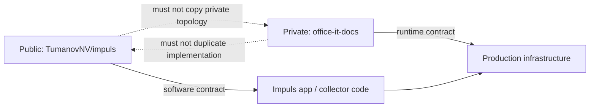
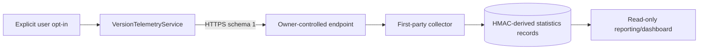
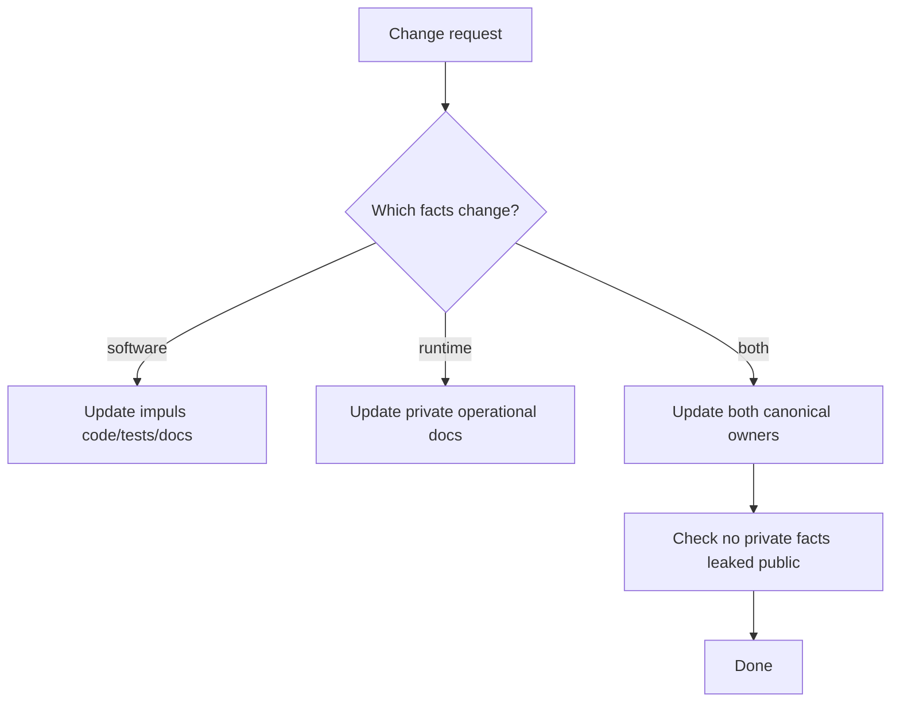

# Public / Private Operations Boundary

## Decision

Impuls documentation is intentionally split across two repositories with different disclosure and ownership boundaries.

### Public engineering source of truth — this repository

`TumanovNV/impuls` owns facts about:

- source code and application architecture;
- module behavior and state ownership;
- macOS permissions and data/privacy boundaries;
- persisted application schemas and migrations;
- unit/integration tests and CI invariants;
- release, Sparkle update and signing software contracts;
- telemetry client payload/consent behavior;
- first-party collector/dashboard implementation;
- public website and product privacy/security statements.

### Private operational source of truth

The private infrastructure documentation vault `office-it-docs` owns facts about:

- which production host currently runs an Impuls service;
- actual network/VPN/reverse-proxy topology;
- production service/unit state;
- server filesystem placement;
- operational backup/restore state and commands;
- private dashboard access boundary;
- infrastructure incident/recovery runbooks;
- CMDB/runtime relationships.

Its project entrypoint is `office-it-docs: Проекты/Impuls.md` (repository access required).

## Why this split exists

A public repository benefits from precise security architecture, but it does **not** need a continuously updated map of private infrastructure. Conversely, operational engineers need real runtime facts, but duplicating Swift implementation and schema definitions into the infrastructure vault creates drift.

## Fact ownership examples

| Question | Read here | Read private ops vault |
| --- | --- | --- |
| What JSON does the version heartbeat send? | Yes | No duplication needed |
| How is telemetry consent represented? | Yes | No duplication needed |
| Which code validates `/v1/heartbeat`? | Yes | No duplication needed |
| What are collector DB tables and retention semantics? | Yes, software contract | Runtime/backup state only |
| Which production node currently runs collector? | No | Yes |
| What private route reaches collector? | Abstract boundary only | Yes |
| Is the dashboard intentionally private/read-only? | Yes, design contract | Yes, current access/runbook |
| What is the exact current service state? | No | Yes |
| Where are credentials/private keys? | Never the value | Location/procedure may be documented privately; value never in Git |

## Public telemetry architecture

This repository may document the abstract data path:

It should not turn that diagram into an inventory of private network addresses, VPN peers or credentials.

## What is safe to keep public

- exact application payload fields because they are part of the privacy contract;
- endpoint path `/v1/heartbeat` because it is a protocol contract already shipped in code;
- collector input limits and validation rules;
- HMAC/retention design;
- dashboard read-only/public-exposure design rule;
- software service/environment variable **names** when already part of open-source deployment code;
- threat model and expected operational controls in abstract terms.

## What stays private

Do not add to this repository solely for documentation convenience:

- private/internal IP addresses;
- VPN peer configuration/topology details not required by shipped code;
- SSH access details;
- production filesystem inventory beyond portable software defaults/contracts;
- backup locations specific to production infrastructure;
- admin URLs reachable only inside private networks;
- current host/service operational status;
- incident-sensitive topology.

## What never belongs in either Git repository

Secret **values** are runtime secrets, not documentation:

- HMAC secrets;
- Sparkle private signing key;
- Apple signing/private keys;
- access/refresh tokens;
- passwords;
- session cookies;
- `.env` contents containing credentials;
- private keys and recovery secrets.

A private document may say **where/how a secret is supplied or rotated**, without recording its value.

## Cross-repository change protocol

When a change affects only software behavior, update this repository only.

When a change affects only runtime placement/topology/runbook, update the private operational vault only.

When a change affects both, treat it as one logical change window:

Examples requiring both:

- telemetry endpoint/proxy contract change;
- collector deployment model change;
- new collector database migration requiring an operational backup/rollback procedure;
- dashboard exposure/access-model change;
- infrastructure change that alters a shipped client configuration.

## AI agent rule

An AI working in `TumanovNV/impuls` should **not infer** current production topology from old public audits, generic deployment examples or source defaults.

If private `office-it-docs` is connected and the task explicitly requires operational current-state, start from its `Проекты/Impuls.md` hub and follow its source-of-truth routing.

If the private source is unavailable, state that runtime/topology current-state is unverified rather than guessing.

An AI working only on application code does not need private ops access.

## Related public docs

- [Version Statistics Collector](../07-web/version-statistics-collector.md)
- [Networking](../01-architecture/networking.md)
- [Threat Model](../06-security/threat-model.md)
- [Privacy Boundaries](../06-security/privacy-boundaries.md)
- [Schema & Migration Registry](schema-migration-registry.md)
- [AI Index](../10-ai/AI-INDEX.md)
