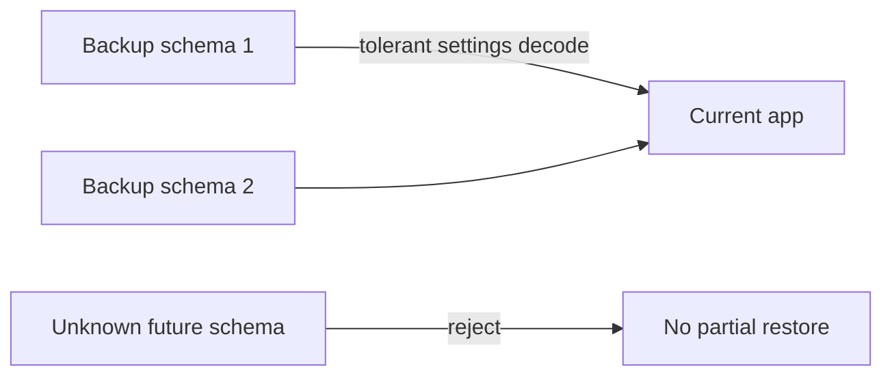
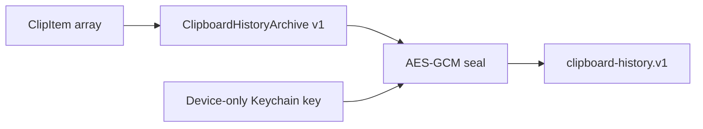

# Schema & Migration Registry

## Purpose

This is the compatibility registry for data that survives longer than one in-memory session or crosses a process/machine boundary.

A developer or AI agent must consult this document before changing:

- `UserDefaults` keys or Codable settings;
- files under Application Support;
- encrypted clipboard persistence;
- backup import/export format;
- Keychain identities used as persistent application state;
- onboarding/version-state keys;
- version-statistics payloads;
- collector SQLite shape.

The registry records **ownership and compatibility policy**, not secret values.

## Compatibility principles

1. Existing user data must not be silently discarded because a new optional field appeared.
2. A newly introduced privacy-sensitive feature defaults to **off** when an older snapshot lacks its field.
3. Per-device identifiers and machine-local consent state do not travel in backups.
4. Tests must never point at the user's real Application Support or production Keychain-owned data.
5. Breaking stored-format changes require an explicit version/migration path before release.
6. Unknown future backup schema versions are rejected rather than partially applied.
7. Public software schema and private production topology are separate concerns; see [Operations Boundary](operations-boundary.md).

## Registry

| Contract | Current version / key | Owner | Storage / transport | Backup | Compatibility / migration |
| --- | --- | --- | --- | --- | --- |
| Main settings snapshot | `settings.v1` | `SettingsStore`, `ImpulsSettingsSnapshot` | `UserDefaults` JSON data | Included | Decoder supplies safe defaults for fields added later; unknown `PanelSize` falls back instead of invalidating the entire snapshot. |
| External-device presentation prefs | `appleDevices.presentation.v1` | `SettingsStore` | local `UserDefaults` Codable blob | Excluded | Contains HMAC-derived local preference keys only; bounded/normalized before use. Never promote to exported settings. |
| Menu Bar selected-device pref | `menuBarWorkspace.presentation.v1` | `SettingsStore` | local `UserDefaults` Codable blob | Excluded | Physical-device selection is meaningful only on the current Mac. Generic Menu Bar configuration lives in the main snapshot. |
| Low-battery alert preference | `appleDevices.lowBatteryAlerts.enabled` | `SettingsStore` / alert service | local `UserDefaults` bool | Excluded | macOS notification authorization and this preference are machine-local. |
| Interface language preference | `app.language.v1` | `AppLanguageService` | local `UserDefaults` string | Excluded | The only persistent record of the in-app language choice; `SettingsStore` holds the service by composition and keeps no second copy. An absent, unparsable or no-longer-shipped value degrades to `system` in memory without writing. Both keys are flushed synchronously on selection, because a confirmed change restarts the app moments later and the next process has to read the new value. |
| Interface language system override | `AppleLanguages` (app domain) | `AppLanguageService` | local `UserDefaults` string array | Excluded | Not an Impuls key: this is the macOS per-app language mechanism, and the user may have set it from macOS itself. Written only on an explicit choice in Settings, and removed only when the user returns to `system` after Impuls had set it. Reading state never writes or clears it. |
| Clipboard image setting legacy key | `saveClipboardImages` | `SettingsStore` / `LegacyMigration` | `UserDefaults` | represented in main snapshot | Legacy Cyclop value may be copied during one-time migration when the new value is absent. |
| Shelf references | `shelf.urls` | `ShelfStore` | `UserDefaults` string array | Excluded | References only; missing files are removed on load. Legacy Cyclop value can be migrated once. |
| Notes | `notes.json` | `NoteStore` | `~/Library/Application Support/Impuls/` | Included | JSON `[Note]`, bounded read and maximum item count; writes are atomic and isolated through `StorageEnvironment`. |
| Snippets | `snippets.json` | `SnippetStore` | `~/Library/Application Support/Impuls/` | Included | Human-editable JSON `[Snippet]`, bounded read, item limit and tolerant optional `label`. |
| Clipboard history archive | archive schema `1`, file `clipboard-history.v1` | `ClipboardHistoryPersistence` | encrypted file under Application Support | Excluded | AES-GCM archive must decode to the exact supported archive version. Disabling persistence deletes archive and its dedicated key. |
| Clipboard encryption key | service `io.tumanov.impuls.clipboard-history`, account `archive-key.v1` | `ClipboardHistoryPersistence` | macOS Keychain | Excluded | Random 256-bit device-only key. Never serialize or export it. |
| Device identity HMAC key | service `io.tumanov.impuls.device-identity`, account `device-identity-key.v1` | `DeviceIdentityResolver` | macOS Keychain | Excluded | Raw hardware identifier is consumed only at the identity boundary; output is local HMAC-derived identity. Keychain failure degrades to process-lifetime key instead of failing the module. |
| Exported backup | `ImpulsBackupDocument.schemaVersion = 2` | `BackupService` | user-selected JSON file | n/a | Reader accepts schema versions `1...2`; v1 remains readable through tolerant `ImpulsSettingsSnapshot` decoding; unsupported future schema is rejected. |
| Onboarding completion | `impuls.onboarding.v2.completed` | `OnboardingWindowController` | `UserDefaults` | Excluded | Versioned independently from app settings so upgrades do not replay first-run state. |
| Onboarding seen version | `impuls.onboarding.v2.seenVersion` | `OnboardingWindowController` | `UserDefaults` | Excluded | Determines What's New vs no presentation; closing an automatic presentation records the current version. |
| Telemetry onboarding offer | `impuls.onboarding.1.4.11.telemetryOfferShown` | onboarding flow | `UserDefaults` | Excluded | Prevents repeatedly presenting an undecided optional statistics offer on ordinary upgrades. |
| Version-statistics consent | `versionStatistics.consent.v1` | `VersionTelemetryService` | `UserDefaults` | Excluded | Separate explicit consent from update networking. Unknown means no heartbeat. |
| Version-statistics cadence/state | `versionStatistics.lastAttempt.v1`, `lastAttemptVersion.v1`, `lastObservedVersion.v1`, `pendingPreviousVersion.v1` | `VersionTelemetryService` | `UserDefaults` | Excluded | One-hour attempt throttle is scoped to `(lastAttemptVersion, lastAttempt)` and recorded before suspension/network work, including failures; a running version different from `lastAttemptVersion` is not throttled by it, so an update gets one immediate attempt. `lastAttemptVersion.v1` is new in 1.4.14: an install that predates it has no value for the key, which is read as "different from the current version" and therefore also does not throttle — no separate migration code needed. Previous-version transition is cleared only after successful server acceptance. |
| Version-statistics installation ID | Keychain account `installation-id.v1` | `KeychainInstallationIDStore` | macOS Keychain | Excluded | Random UUID v4, device-local. Raw value is sent only after explicit opt-in; collector persists only an HMAC digest. |
| Version heartbeat | JSON `schema: 1` | `VersionTelemetryService` + collector | `POST /v1/heartbeat` | n/a | Exact allow-listed fields, canonical UUID v4, bounded version strings, max request body enforced by collector. Changing payload requires coordinated client/collector/tests/docs change. |
| Collector database | SQLite schema `1` via `PRAGMA user_version = 1`; tables `installations` + `transitions` | `Collector/version-statistics/collector.py` | SQLite/WAL | operational backup, not app backup | Historical unversioned schema is treated as v0 and adopted only after exact table-column validation. Existing rows are preserved. Future schema versions are rejected by older collectors. Every future version bump requires an ordered migration and tests from every supported prior schema. |
| Cyclop → Impuls migration marker | `migration.cyclop.completed` | `LegacyMigration` | `UserDefaults` | Excluded | One-time migration copies supported files/preferences only when destination values are absent, then records completion. |

## Main settings compatibility

`ImpulsSettingsSnapshot` deliberately mixes strict and tolerant decoding.

### Required core fields

The core interaction model (`hotKey`, `activationMode`, `openDelay`, `modules`) is decoded as required data. Corrupting these is treated differently from a new optional feature field.

### Tolerant fields and safe defaults

Current defaults include:

- missing/unknown `panelSize` → `.standard`;
- missing `saveClipboardImages` → `true`;
- missing `persistClipboardHistory` → `false`;
- missing `clipboardRetention` → `.sevenDays`;
- missing excluded-app list → `[]`;
- missing external Apple devices consent → `false`;
- missing/partial Menu Bar configuration → normalized default configuration.

The important privacy rule is that an older settings blob must **not enable a newly introduced sensitive behavior merely because the app was updated**.

## Backup schema evolution

Current backup payload contains:

- `schemaVersion`;
- `createdAt`;
- `appVersion`;
- `settings`;
- `snippets`;
- `notes`.

It intentionally does **not** export clipboard history, raw/local device identity, notification consent, telemetry installation identity or other machine-local secrets/state.

Tests: [`BackupDocumentTests.swift`](../../Tests/ImpulsTests/BackupDocumentTests.swift).

## Clipboard archive evolution

The encrypted container and its decoded payload have separate concerns:

`ClipboardHistoryArchive.currentVersion` is checked after successful AES-GCM authentication. A future incompatible payload must increment the archive version and define a deliberate migration or rejection policy.

Tests: [`ClipboardHistoryPersistenceTests.swift`](../../Tests/ImpulsTests/ClipboardHistoryPersistenceTests.swift).

## Изменения 1.4.12-hardening

Persisted-контракт не менялся. `ClipboardHistoryPersistence` service/account стали инжектируемыми параметрами со значениями по умолчанию `io.tumanov.impuls.clipboard-history` / `archive-key.v1` — те же строки, что и раньше; смысл в том, чтобы тест пути записи не мог создать или удалить настоящий ключ. Формат архива, версия и путь файла не тронуты.

`SnippetStore` перешёл на запись из serial queue с синхронным flush на выходе. Формат `snippets.json` и его границы не изменились.

**Forward compatibility архива — write latch.** Формат не менялся, но правило замены файла — да, и это часть контракта совместимости. `EncryptedClipboardArchive.open` отвергает `version != currentVersion`, поэтому архив, записанный более новой сборкой, для текущей нечитаем. Раньше это заканчивалось перезаписью: `load()` возвращал пустой результат, и первое же копирование запечатывало его поверх — понижение версии уничтожало историю. Теперь неудачное чтение переводит `ClipboardHistoryPersistence` в состояние, в котором `saveImmediately` — единственная точка записи файла — не пишет ничего, пока чтение не удастся. То же покрывает архив сверх бюджета 64 MiB и недоступный ключ. Единственное исключение — `delete()`, то есть явное выключение persistence пользователем. Подробности жизненного цикла и восстановления — в [Clipboard](../02-modules/clipboard.md).

## Legacy product migration

`LegacyMigration.runIfNeeded()` is the explicit Cyclop → Impuls bridge.

It currently handles:

- `Application Support/Cyclop/notes.json` → `Application Support/Impuls/notes.json` when destination is absent;
- `snippets.json` using the same rule;
- legacy defaults suite `com.cyclop.app` for `shelf.urls` and `saveClipboardImages`, only when the new standard defaults have no value;
- completion marker `migration.cyclop.completed`.

Do not overload this migration with unrelated future schema upgrades. New migration families should get their own version/marker and tests.

## Collector database migration policy

The collector now has a formal database migration boundary. `DATABASE_SCHEMA_VERSION` is the code-level current version and SQLite `PRAGMA user_version` is the on-disk version marker.

### v0 → v1

Schema `0` represents either a brand-new SQLite file or the historical Impuls database created before explicit versioning. The migration:

1. starts an immediate transaction;
2. creates the known v1 tables/indexes only if absent;
3. verifies that `installations` and `transitions` have exactly the supported column sets;
4. writes `PRAGMA user_version = 1` only after validation succeeds;
5. commits without rewriting existing telemetry rows.

If the legacy shape is unexpected, the transaction rolls back and startup fails with `DatabaseMigrationError`. If the file advertises a schema version greater than the running collector supports, startup also fails. An old binary must never silently operate on a future database.

### Future versions

A schema `N -> N+1` change must add an explicit ordered migration in `collector.py`, deterministic tests that begin from schema `N`, and public schema documentation. Before production deployment, the private infrastructure runbook must define a SQLite-safe pre-migration backup, service stop/start sequence, validation, and rollback conditions.

Tests: [`test_collector_database_migrations.py`](../../Tests/PythonTests/test_collector_database_migrations.py) and [`test_version_statistics.py`](../../Tests/PythonTests/test_version_statistics.py).

## Change checklist

For any schema change:

1. Identify the registry row and data owner.
2. Decide whether the change is backward compatible.
3. Define upgrade behavior and, when relevant, downgrade behavior.
4. Add/update deterministic migration tests.
5. Review backup inclusion/exclusion.
6. Review privacy/security implications.
7. Update canonical architecture/module docs.
8. Regenerate [Type → Tests → Docs Map](generated-type-test-doc-map.md) if ownership/types changed.
9. If production telemetry runtime is affected, update the private operational source of truth described in [Operations Boundary](operations-boundary.md).

## Primary implementation references

- [`SettingsStore.swift`](../../Sources/Impuls/Settings/SettingsStore.swift)
- [`StorageEnvironment.swift`](../../Sources/Impuls/Services/StorageEnvironment.swift)
- [`BackupService.swift`](../../Sources/Impuls/Services/BackupService.swift)
- [`ClipboardHistoryPersistence.swift`](../../Sources/Impuls/Services/ClipboardHistoryPersistence.swift)
- [`AppleDeviceIdentity.swift`](../../Sources/Impuls/Services/AppleDeviceIdentity.swift)
- [`LegacyMigration.swift`](../../Sources/Impuls/Services/LegacyMigration.swift)
- [`VersionTelemetryService.swift`](../../Sources/Impuls/Services/VersionTelemetryService.swift)
- [`collector.py`](../../Collector/version-statistics/collector.py)

## Verification references

- [`SettingsStoreTests.swift`](../../Tests/ImpulsTests/SettingsStoreTests.swift)
- [`SettingsMigration147Tests.swift`](../../Tests/ImpulsTests/SettingsMigration147Tests.swift)
- [`SettingsMigration1410Tests.swift`](../../Tests/ImpulsTests/SettingsMigration1410Tests.swift)
- [`StorageIsolationTests.swift`](../../Tests/ImpulsTests/StorageIsolationTests.swift)
- [`BackupDocumentTests.swift`](../../Tests/ImpulsTests/BackupDocumentTests.swift)
- [`ClipboardHistoryPersistenceTests.swift`](../../Tests/ImpulsTests/ClipboardHistoryPersistenceTests.swift)
- [`VersionTelemetryServiceTests.swift`](../../Tests/ImpulsTests/VersionTelemetryServiceTests.swift)
- [`test_collector_database_migrations.py`](../../Tests/PythonTests/test_collector_database_migrations.py)
- [`test_version_statistics.py`](../../Tests/PythonTests/test_version_statistics.py)
