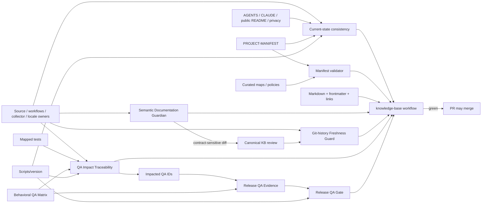

# IMPULS Knowledge Base

Current engineering knowledge base for humans, Obsidian and AI agents.

Documentation baseline: **1.4**. Exact product version is owned by `Scripts/version`; current shipped summary is [Project Status](00-project/project-status.md).

## 00 — Project
- [Project Overview](00-project/project-overview.md)
- [Project Status](00-project/project-status.md)
- [Pre-Audit Baseline — 1.4.12](00-project/pre-audit-baseline-1.4.12.md)

## 01 — Architecture
- [Architecture Overview](01-architecture/architecture-overview.md)
- [Application Lifecycle](01-architecture/application-lifecycle.md)
- [State and Ownership](01-architecture/state-and-ownership.md)
- [Multi-Display](01-architecture/multi-display.md)
- [Storage and Persistence](01-architecture/storage-persistence.md)
- [Permissions](01-architecture/permissions.md)
- [Networking](01-architecture/networking.md)
- [Settings, Onboarding and Feedback](01-architecture/settings-onboarding-feedback.md)
- [System Diagrams](01-architecture/system-diagrams.md)

## 02 — Modules
- [Module Catalog](02-modules/README.md)
- [Actions](02-modules/actions.md)
- [Music](02-modules/music.md)
- [Shelf](02-modules/shelf.md)
- [Clipboard](02-modules/clipboard.md)
- [Snippets](02-modules/snippets.md)
- [Calendar](02-modules/calendar.md)
- [Translate](02-modules/translate.md)
- [Notes](02-modules/notes.md)
- [Power / Battery](02-modules/power.md)
- [Menu Bar Workspace](02-modules/menu-bar.md)

## 03 — macOS
- [Permissions and TCC](03-macos/permissions-and-tcc.md)
- [Signing and Distribution](03-macos/signing-distribution.md)

## 04 — Development
- [Local Build](04-development/building-locally.md)
- [Testing Strategy](04-development/testing.md)
- [Adding a Module](04-development/adding-a-module.md)
- [Localization](04-development/localization.md)
- [Documentation Standard](04-development/documentation-standard.md)

## 05 — Release
- [Release Process](05-release/release-process.md)
- [Release Pipeline](05-release/release-pipeline.md)
- [Update System](05-release/update-system.md)

## 06 — Security
- [Security Model](06-security/security-model.md)
- [Threat Model](06-security/threat-model.md)
- [Data Classification](06-security/data-classification.md)
- [Privacy Boundaries](06-security/privacy-boundaries.md)
- [Dependency and Supply-Chain Policy](06-security/supply-chain.md)

## 07 — Web / Operations software
- [Website Architecture](07-web/website.md)
- [Website Legal and Privacy Localization](07-web/legal-privacy.md)
- [Website Design System](07-web/design-system.md)
- [Version Statistics Collector](07-web/version-statistics-collector.md)

## 08 — Decisions
- [ADR Index](08-decisions/README.md)

## 09 — Known limitations
- [Current Limitations](09-known-issues/current-limitations.md)

## 10 — AI
- [AI Index](10-ai/AI-INDEX.md)
- [Repository Map](10-ai/repository-map.md)
- [Invariants](10-ai/invariants.md)
- [Agent Rules](10-ai/agent-rules.md)
- [Change Impact Matrix](10-ai/change-impact-matrix.md)
- [Documentation Guardian](10-ai/documentation-guardian.md)

## 11 — History
- [Architecture Timeline](11-history/architecture-timeline.md)
- [Release Architecture Ledger](11-history/release-architecture-ledger.md)

## 12 — Reference
- [Reference Layer Index](12-reference/README.md)
- [Machine-Readable Project Manifest](12-reference/project-manifest.md)
- [Schema & Migration Registry](12-reference/schema-migration-registry.md)
- [Core Type Reference](12-reference/core-type-reference.md)
- [Generated Type → Tests → Docs Map](12-reference/generated-type-test-doc-map.md)
- [Background Work & Concurrency Registry](12-reference/background-concurrency-registry.md)
- [Input & Resource Budget Registry](12-reference/resource-budget-registry.md)
- [Public / Private Operations Boundary](12-reference/operations-boundary.md)

## 13 — Behavioral QA
- [Behavioral QA Index](13-qa/README.md)
- [Behavioral QA Matrix](13-qa/behavioral-qa-matrix.md)
- [Behavioral QA Change Impact Traceability](13-qa/change-impact-traceability.md)
- [Release QA Evidence](13-qa/release-evidence/README.md)
- [1.4.11 Retrospective Evidence](13-qa/release-evidence/1.4.11.md)
- [1.4.12 Release Evidence](13-qa/release-evidence/1.4.12.md)
- [1.4.13 Release Evidence](13-qa/release-evidence/1.4.13.md)
- [1.4.14 Release Evidence](13-qa/release-evidence/1.4.14.md)
- [1.4.15 Release Evidence](13-qa/release-evidence/1.4.15.md)

## v1.4 anti-drift loop

v1.4 retains the v1.3 performance/concurrency, resource-budget, behavioral-QA, release-evidence, semantic Guardian and historical-freshness layers and adds a focused **current-documentation consistency guard**. The new layer exists because a syntactically valid entrypoint can still quietly claim an old release, old RU/EN website model or legacy privacy URL.

`Scripts/check-current-documentation.py` compares current app localization owners (`Resources/*.lproj`, `AppLanguageService`, `CFBundleLocalizations`), the website registry and legal locale configs, and verifies high-value agent/public routes. It also prevents AGENTS/current project docs from becoming duplicate release databases and checks the canonical `/privacy/` route in public entrypoints. Historical release/audit evidence is intentionally outside this rule: old version context remains valid when the document is explicitly historical.

The QA impact checker maps changed production owners and mapped tests to concrete Behavioral QA IDs. A new tracked behavioral source file with no QA route fails closed until an impact rule or narrow documented exemption is added. On a version-bump diff, impacted non-automated IDs must also appear in that version's release evidence.

The release QA gate keeps the scenario inventory separate from pass evidence. `1.4.11` is an explicit retrospective baseline; from `1.4.12` onward every manual/mixed scenario must be classified in the version-specific evidence file and `blocked` candidates fail the knowledge-base CI gate.

The knowledge-base workflow also runs weekly. Scheduled runs enable periodic review-age enforcement; normal PRs enforce routing/current-state consistency, source→docs drift, source/test→QA traceability and current release-evidence consistency.

## Operational source-of-truth boundary

This public repository owns application/software facts. Current private production topology/runtime facts for Impuls telemetry are maintained in the private infrastructure documentation vault. See [Public / Private Operations Boundary](12-reference/operations-boundary.md).

## Source-of-truth rule

Current software contract: code + tests + CI plus the routed canonical knowledge owners. `Scripts/version` owns the exact release number; `PROJECT-MANIFEST.json` owns routing, not copied implementation facts. Historical release/handoff/audit documents preserve evidence and context, but do not override current implementation.

For a whole-repository security/performance audit, use [Pre-Audit Baseline — 1.4.12](00-project/pre-audit-baseline-1.4.12.md) as the historical handoff after verifying `Scripts/version` and current `main`.

Release certification claims require the version-specific Release QA Evidence record; the Behavioral QA Matrix alone is never pass evidence. Change-impact claims are derived from the machine-readable QA impact map plus the actual Git diff, not from memory.

For private production runtime, use the private operational source of truth rather than inferring from public source defaults or old audits.
