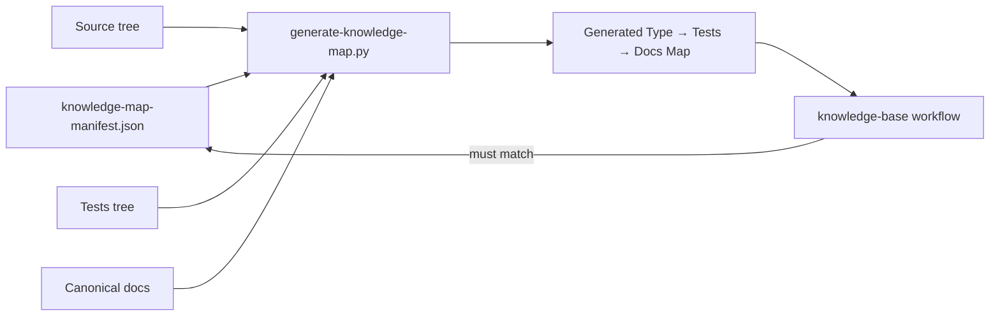

# IMPULS Knowledge Base

Current engineering knowledge base for humans, Obsidian and AI agents.

Documentation baseline: **1.2**. Product baseline: **Impuls 1.4.11**.

## 00 — Project
- [Project Overview](00-project/project-overview.md)
- [Project Status](00-project/project-status.md)

## 01 — Architecture
- [Architecture Overview](01-architecture/architecture-overview.md)
- [Application Lifecycle](01-architecture/application-lifecycle.md)
- [State and Ownership](01-architecture/state-and-ownership.md)
- [Multi-Display](01-architecture/multi-display.md)
- [Storage and Persistence](01-architecture/storage-persistence.md)
- [Permissions](01-architecture/permissions.md)
- [Networking](01-architecture/networking.md)
- [Settings, Onboarding and Feedback](01-architecture/settings-onboarding-feedback.md)
- [System Diagrams](01-architecture/system-diagrams.md)

## 02 — Modules
- [Module Catalog](02-modules/README.md)
- [Actions](02-modules/actions.md)
- [Music](02-modules/music.md)
- [Shelf](02-modules/shelf.md)
- [Clipboard](02-modules/clipboard.md)
- [Snippets](02-modules/snippets.md)
- [Calendar](02-modules/calendar.md)
- [Translate](02-modules/translate.md)
- [Notes](02-modules/notes.md)
- [Power / Battery](02-modules/power.md)
- [Menu Bar Workspace](02-modules/menu-bar.md)

## 03 — macOS
- [Permissions and TCC](03-macos/permissions-and-tcc.md)
- [Signing and Distribution](03-macos/signing-distribution.md)

## 04 — Development
- [Local Build](04-development/building-locally.md)
- [Testing Strategy](04-development/testing.md)
- [Adding a Module](04-development/adding-a-module.md)
- [Localization](04-development/localization.md)
- [Documentation Standard](04-development/documentation-standard.md)

## 05 — Release
- [Release Process](05-release/release-process.md)
- [Release Pipeline](05-release/release-pipeline.md)
- [Update System](05-release/update-system.md)

## 06 — Security
- [Security Model](06-security/security-model.md)
- [Threat Model](06-security/threat-model.md)
- [Data Classification](06-security/data-classification.md)
- [Privacy Boundaries](06-security/privacy-boundaries.md)

## 07 — Web / Operations software
- [Website Architecture](07-web/website.md)
- [Version Statistics Collector](07-web/version-statistics-collector.md)

## 08 — Decisions
- [ADR Index](08-decisions/README.md)

## 09 — Known limitations
- [Current Limitations](09-known-issues/current-limitations.md)

## 10 — AI
- [AI Index](10-ai/AI-INDEX.md)
- [Repository Map](10-ai/repository-map.md)
- [Invariants](10-ai/invariants.md)
- [Agent Rules](10-ai/agent-rules.md)
- [Change Impact Matrix](10-ai/change-impact-matrix.md)

## 11 — History
- [Architecture Timeline](11-history/architecture-timeline.md)

## 12 — Reference
- [Reference Layer Index](12-reference/README.md)
- [Schema & Migration Registry](12-reference/schema-migration-registry.md)
- [Core Type Reference](12-reference/core-type-reference.md)
- [Generated Type → Tests → Docs Map](12-reference/generated-type-test-doc-map.md)
- [Public / Private Operations Boundary](12-reference/operations-boundary.md)

## v1.2 machine-checked reference loop

The map covers important ownership boundaries rather than every Swift symbol. Architectural ownership remains curated; existence and freshness are machine-checked.

## Operational source-of-truth boundary

This public repository owns application/software facts. Current private production topology/runtime facts for Impuls telemetry are maintained in the private infrastructure documentation vault. See [Public / Private Operations Boundary](12-reference/operations-boundary.md).

## Source-of-truth rule

Current software contract: knowledge base + code + tests + CI. Historical release/handoff/audit documents preserve evidence and context, but do not override current implementation.

For private production runtime, use the private operational source of truth rather than inferring from public source defaults or old audits.
